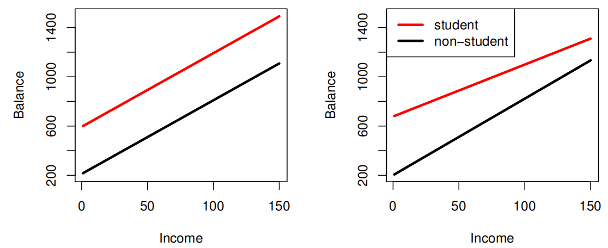
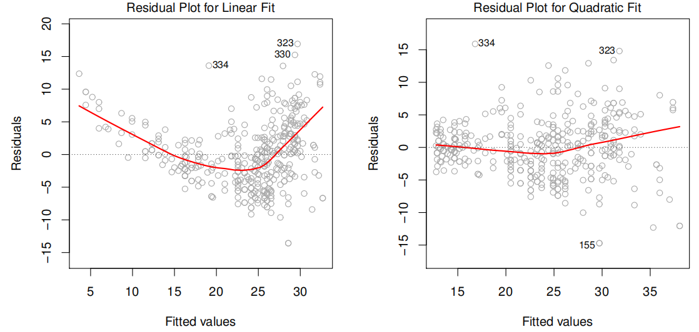
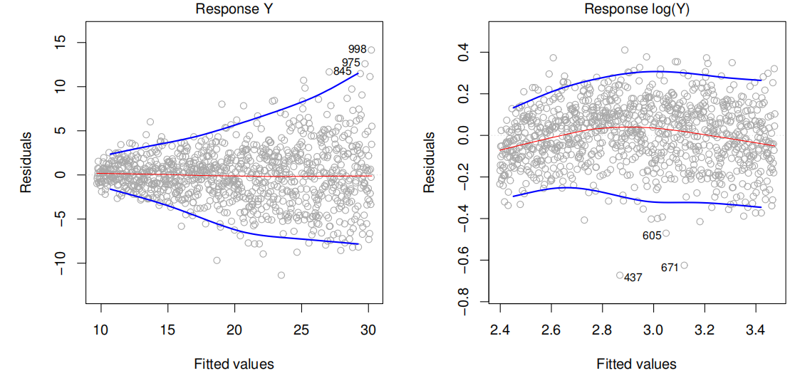
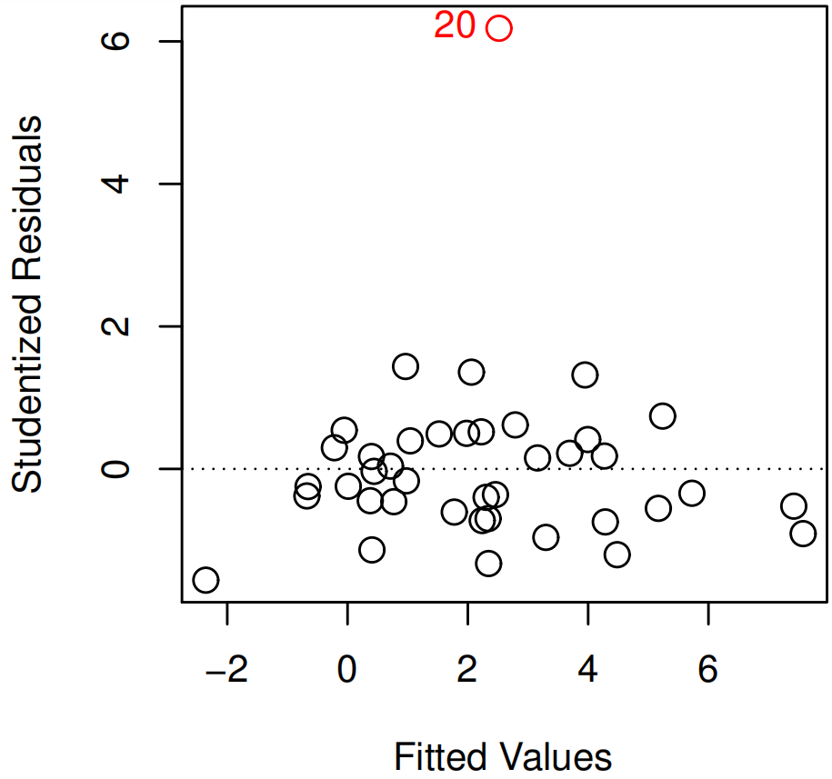
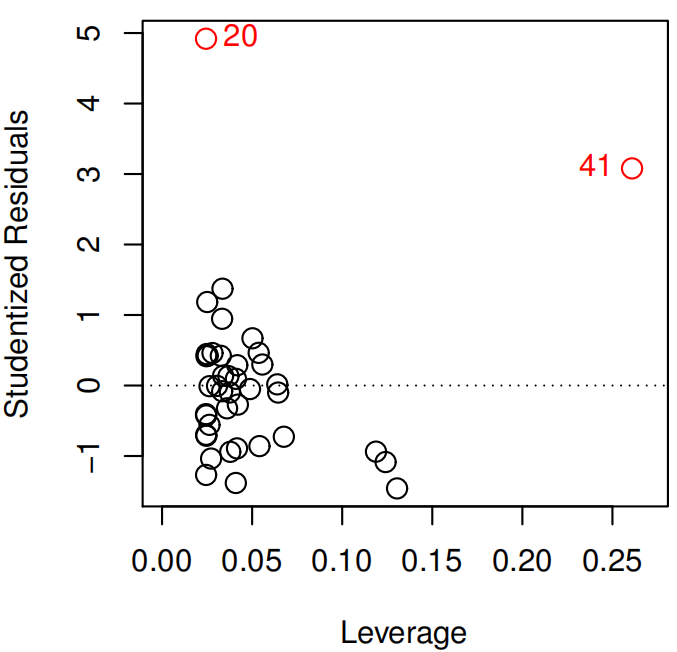

An Introduction to Statistical Learning
================

- <a href="#basic-concepts" id="toc-basic-concepts">1 Basic concepts</a>
  - <a href="#reducible-and-irreducible-error"
    id="toc-reducible-and-irreducible-error">1.1 Reducible and irreducible
    error</a>
  - <a href="#types-of-models" id="toc-types-of-models">1.2 Types of models</a>
  - <a href="#evaluating-model-performance"
    id="toc-evaluating-model-performance">1.3 Evaluating model performance</a>
- <a href="#linear-regresion" id="toc-linear-regresion">2 Linear regresion</a>
  - <a href="#getting-the-least-squares-line-of-a-sample"
    id="toc-getting-the-least-squares-line-of-a-sample">2.1 Getting the Least Squares Line of
    a sample</a>
  - <a href="#getting-confident-intervarls-of-coeffients"
    id="toc-getting-confident-intervarls-of-coeffients">2.2 Getting confident intervarls of
    coeffients</a>
  - <a href="#accuracy-of-the-model" id="toc-accuracy-of-the-model">2.3 Accuracy of the Model</a>
  - <a href="#insights-to-extract" id="toc-insights-to-extract">2.4 Insights to extract</a>
  - <a href="#standard-linear-regression-model-assumptions"
    id="toc-standard-linear-regression-model-assumptions">2.5 Standard linear regression model
    assumptions</a>
    - <a href="#including-an-interaction-term"
      id="toc-including-an-interaction-term">2.5.1 Including an interaction
      term</a>
    - <a href="#polynomial-regression" id="toc-polynomial-regression">2.5.2 Polynomial regression</a>
  - <a href="#possible-problems" id="toc-possible-problems">2.6 Possible problems</a>

# Basic concepts

## Reducible and irreducible error

The goal when we are analyzing data is to find a function that based on
some Predictors and some random noise could explain the Response
variable.

$$
Y = f(X) + \epsilon
$$

**$\epsilon$** represent the **random error** and correspond to the
**irreducible error** as it cannot be predicted using the Predictors in
regression models. It would have a mean of 0 unless are missing some
relevant Predictors.

In classification models, the **irreducible error** is represented by
the **Bayes Error Rate**.

$$
1 -  E\left( 
     \underset{j}{max}Pr(Y = j|X)
     \right)
$$

An error is **reducible** if we can improve the accuracy of $\hat{f}$ by
using a most appropriate statistical learning technique to estimate $f$.

The challenge to achieve that goal it’s that we don’t at the beginning
how much of the error correspond to each type.

$$
\begin{split}
E(Y-\hat{Y})^2 & = E[f(X) + \epsilon - \hat{f}(X)]^2 \\
               & = \underbrace{[f(X)- \hat{f}(x)]^2}_\text{Reducible} +
                   \underbrace{Var(\epsilon)}_\text{Irredicible}
\end{split}
$$

The reducible error can be also spitted in two parts:

- **Variance** refers to the amount by which $\hat{f}$ would change if
  we estimate it using a different **training data set**. If a method
  has high variance then small changes in the training data can result
  in large changes of $\hat{f}$.

- **Squared bias** refers to the error that is introduced by
  approximating a real-life problem, which may be extremely complicated,
  by a much simpler model as for example a linear model.

$$
E(y_{0} - \hat{f}(x_{0}))^2 = 
Var(\hat{f}(x_{0})) + 
[Bias(\hat{f}(x_{0}))]^2 + 
Var(\epsilon)
$$

> **Note**
>
> Our challenge lies in finding a method for which both the variance and
> the squared bias are low.

## Types of models

- **Parametric methods**
  1.  Make an assumption about the functional form. For example,
      assuming linearity.
  2.  Estimate a small number parameters based on training data.
  3.  Are easy to interpret.
- **Non-parametric methods**
  1.  Don’t make an assumption about the functional form, to accurately
      fit a wider range of possible shapes for $f$.
  2.  Need a large number of observations in order to obtain an accurate
      estimate for $f$.
  3.  The data analyst must select a level of smoothness (degrees of
      freedom).

## Evaluating model performance

To evaluate how good works a models we need to split the available data
in two parts.

- **Training data**: Used to fit the model.
- **Test data**: Used to confirm how well the model works with new data.

Some measurements to evaluate our test data are:

- **Test mean squared error (MSE)**

$$
Ave(y_{0}-\hat{f}(x_{0}))^2
$$

- **Test Error rate**

$$
I(y_{0} \neq \hat{y}_{0}) = 
\begin{cases}
    1 & \text{If } y_{0} \neq \hat{y}_{0} \\
    0 & \text{If } y_{0} = \hat{y}_{0}
\end{cases}
$$

$$
Ave(I(y_{0} \neq \hat{y}_{0}))
$$

# Linear regresion

## Getting the Least Squares Line of a sample

As the *population regression line* is unobserved the *least squares
line* of a sample is a good estimation. To get it we need to follow the
next steps:

1.  Define the function to fit.

$$
\hat{y} = \hat{\beta}_{0} + \hat{\beta}_{1} x
$$

2.  Define how to calculate **residuals**.

$$
e_{i} = y_{i} - \hat{y}_{i}
$$

3.  Define the **residual sum of squares (RSS)**.

$$
RSS = e_{1}^2 + e_{2}^2 + \dots + e_{n}^2
$$

4.  Use calculus or make estimation with a computer to find the
    coefficients that minimize the RSS.

$$
\hat{\beta}_{1} = \frac{\Sigma_{i=1}^{n}(x_{i}-\overline{x})(y_{i}-\overline{y})}
                       {\Sigma_{i=1}^{n}(x_{i}-\overline{x})}
, \quad
\hat{\beta}_{0} = \overline{y} - \hat{\beta}_{1}\overline{x}
$$

## Getting confident intervarls of coeffients

To estimate the **population regression line** we can calculate
**confidence intervals** for sample coefficients, to define a range where
we can find the population values with a defined **confidence level**.

> If we want to use 95% of confidence we need to know that after taking
> many samples only 95% of the intervals produced with this **confident
> level** would have the true value (parameter).

To generate confident intervals we would need to calculate the variance
of the *random error*.

$$
\sigma^2 = Var(\epsilon)
$$

But as we can not calculate that variance an alternative can be to
estimate it based on residuals if they meet the next conditions:

1.  Each residual have common variance $\sigma^2$, so the variances of
    the error terms shouldn’t have any relation with the value of the
    response.
2.  Residuals are uncorrelated. For example, if $\epsilon_{i}$ is
    positive, that provides little or no information about the sign of
    $\epsilon_{i+1}$.

If not, we would end underestimating the true standard errors, reducing
the probability a given confident level to contain the true value of the
parameter and underrating the *p-values* associated with the model.

$$
\sigma \approx RSE = \sqrt{\frac{RSS}{(n-p-1)}}
$$

Now we can calculate the **standard error** of each coefficient and
calculate the confident intervals.

$$
SE(\hat{\beta_{0}})^2 = \sigma^2 
                       \left[\frac{1}{n}+
                             \frac{\overline{x}^2}
                                  {\Sigma_{i=1}^{n} (x_{i}-\overline{x})^2} 
                       \right]
$$

$$
SE(\hat{\beta_{1}})^2 = \frac{\sigma^2}
                             {\Sigma_{i=1}^{n} (x_{i} - \overline{x})^2}
$$

$$  
\hat{\beta_{1}} \pm 2 \cdot SE(\hat{\beta_{1}}), \quad \hat{\beta_{0}} \pm 2 \cdot SE(\hat{\beta_{0}})
$$

## Accuracy of the Model

If we want to know how well the model fits to the data we have two
options:

- **Residual standard error (RSE)**: Even if the model were correct, the
  actual values of $\hat{y}$ would differ from the true regression line
  by approximately *this units*, on average.

- **The $R^2$ statistic**: The proportion of variance explained by
  taking as a reference the **total sum of squares (TSS)**.

$$
TSS = \Sigma(y_{i} - \overline{y})^2
$$

$$
R^2 = \frac{TSS - RSS}{TSS}
$$

$$
R^2 = 
\begin{cases}
    Cor(X, Y)^2  & \text{Simple Lineal Regresion} \\
    Cor(Y,\hat{Y})^2 & \text{Multipline Lineal Regresion}
\end{cases}
$$

## Insights to extract

**1. Is there a relationship between the Response and Predictors?**

Use the regression **overall P-value** (based on the F-statistic) to
confirm that at **least one predictor** is related with the Response and
avoid interpretative problems associated with the number of observations
(*n*) or predictors (*p*).

$$
H_{0}: \beta_{1} = \beta_{2} = \dots = \beta_{p} = 0
$$

$$
H_{a}: \text{at least one } \beta_{j} \text{ is non-zero}
$$

**2. Which Predictors are related with the Response?**

To answer that we can test if a particular subset of q of the
cofficients are zero.

$$
H_{0}: \beta_{p-q+1} = \beta_{p-q+2} = \dots = \beta_{p} = 0
$$

In this case, F-statistic reports the **partial effect** of adding a
extra variable to the model (the order matters) to apply a *variable
selection* technique. The classical approach is to:

1.  Fit a model for each variable combination $2^p$.
2.  Select the best model based on *Mallow’s Cp*, *Akaike information
    criterion (AIC)*, *Bayesian information criterion (BIC)*, and
    *adjusted* $R^2$ or plot various model outputs, such as the
    residuals, in order to search for patterns.

But just think that if we have $p = 30$ we will have
$2^{30} = =1,073,741,824\ models$ to fit, that it’s too much. Some
alternative approaches for this task:

- Forward selection
- Backward selection (cannot be used if p \>n)
- Mixed selection

**3. How well does the model fit the data?**

To achieve this we can use **residual standard error**, the **$R^2$**
and **plotting** the data.

**4. How accurate is our prediction?**

We use prediction intervals to answer this question. Prediction
intervals are always wider than confidence intervals, because they
incorporate both the error in the estimate for $f(x)$ (the reducible
error) and the uncertainty as to how much an individual point will differ
from the population regression plane (the irreducible error).

## Standard linear regression model assumptions

- The **additivity assumption** means that the association between a
  predictor $X_{j}$ and the response $Y$ does not depend on the values
  of the other predictors, as it happens when there is a *interaction
  (synergy) effect*

- The **linearity assumption** states that the change in the response Y
  associated with a one-unit change in $X_{j}$ is constant, regardless
  of the value of $X_{j}$.

### Including an interaction term

This approach relax the *additivity assumption* that models usually
have.

- **2 quantitative variables**

It consist in adding an extra coefficient which multiplies two or more
variables.

$$
\begin{split}
Y & = \beta_{0} + \beta_{1} X_{1} + \beta_{2} X_{2} + \beta_{3} X_{1} X_{2} + \epsilon \\
  & = \beta_{0} + (\beta_{1} + \beta_{3} X_{2}) X_{1} + \beta_{2} X_{2} + \epsilon \\
  & = \beta_{0} + \tilde{\beta}_{1} X_{1} + \beta_{2} X_{2} + \epsilon
\end{split}
$$

After adding the interaction term we could interpret the change as
making one of the original coefficient a function of the another
variable. Now we could say that *$\beta_{3}$ represent **the change of
$X_{1}$ effectiveness** associated with a one-unit increase in $X_{2}$*.

It very important that we keep **hierarchical principle**, which states
that if we include an interaction in a model, we should also include the
main effects, even if the p-values associated with their coefficients
are not significant as ***it would alter the meaning of the
interaction***.

- **1 quantitative and 1 qualitative variable**

If $X_{1}$ is quantitative and $X_{2}$ is qualitative:

$$
\hat{Y} = 
\begin{cases}
    (\beta_{0} + \beta_{2}) + (\beta_{1} + \beta_{3})X_{1} & \text{if }X_{2} \text{ is TRUE}\\
    \beta_{0} + \beta_{1}X_{1}                             & \text{if }X_{2} \text{ is FALSE}
\end{cases}
$$

Adding the $\beta_{3}$ interaction allow the line to change the line
slope based on $X_{2}$ and not just a different intercept.

### Polynomial regression

This approach relax the *linearity assumption* that models usually have.
It consist in including transformed versions of the predictors.

$$
\begin{split}
Y & = \beta_{0} + \beta_{1} X_{1} + \beta_{2} X_{2} \\
  & = \beta_{0} + \beta_{1} X_{1} + \beta_{2} X_{1}^2 
\end{split}
$$

## Possible problems

**1. Non-linearity of the response-predictor relationships**

| Detection method                                                                                                                                                                                                  | Solutions                                                                                                                                   |
|:------------------------------------------------------------------------------------------------------------------------------------------------------------------------------------------------------------------|:--------------------------------------------------------------------------------------------------------------------------------------------|
| Plot the **residuals versus predicted values** $\hat{y}_{i}$. Ideally, the residual plot will show no discernible pattern. The presence of a pattern may indicate a problem with some aspect of the linear model. | A simple approach is to use non-linear transformations of the predictors, such as $\log{X}$, $\sqrt{X}$, and $X^2$, in the regression model |

**2. Correlation of error terms**

| Detection method                                                                                                                                                                                                                                          | Solutions                                                               |
|:----------------------------------------------------------------------------------------------------------------------------------------------------------------------------------------------------------------------------------------------------------|:------------------------------------------------------------------------|
| 1\. Plot the residuals from our model as a function of time or execution order. If the errors are uncorrelated, then there should be no discernible pattern.     2. Check if some observation have been exposed to the same environmental factors | Good experimental design is crucial in order to mitigate these problems |

**3. Non-constant variance (heteroscedasticity) of error terms**

| Detection method                                              | Solutions                                                                              |
|:--------------------------------------------------------------|:---------------------------------------------------------------------------------------|
| Plot the residual plot en check if you can see a funnel shape | We can transform the response using a concave function such as $\log{Y}$ or $\sqrt{Y}$ |

**4. Outliers**

An outlier is a point for which $y_{i}$ is far from the value predicted
by the model. Sometimes, they have little effect on the least squares
line, but *over estimate the RSE* making bigger p-values of the model
and *under estimate the $R^2$*.

| Detection method                                                                                                                                                              | Solutions                                                                                                                                                         |
|:------------------------------------------------------------------------------------------------------------------------------------------------------------------------------|:------------------------------------------------------------------------------------------------------------------------------------------------------------------|
| Plot the **studentized residuals**, computed by dividing each residual $e_{i}$ by its estimated standard error. Then search for points which absolute value is greater than 3 | They can be removed if it has occurred due to an error in data collection. Otherwise, they may indicate a deficiency with the model, such as a missing predictor. |

**5. High-leverage points**

Observations with **high leverage** have an unusual value for $x_{i}$.
High leverage observations tend to have a sizable impact on the
estimated regression line and any problems with these points may
invalidate the entire fit.

| Detection method                                                                                                                                              | Solutions                                                             |
|:--------------------------------------------------------------------------------------------------------------------------------------------------------------|:----------------------------------------------------------------------|
| Compute the leverage statistic. Find an observation with higher value than mean, represented by $(p + 1)/n$. Leverage values are always between $1/n$ and $1$ | Make sure that the value is correct and not a data collection problem |

$$
h_{i} = \frac{1}{n} + 
        \frac{(x_{i} - \overline{x})^2}
              {\Sigma_{i'=1}^n(x_{i'} - \overline{x})^2}
$$

In a *multiple linear regression*, it is possible to have an observation
that is well within the range of each individual predictor’s values, but
that is unusual in terms of the full set of predictors.

**6. Collinearity**

**Collinearity** refers to the situation in which two or more predictor
variables are closely related (highly correlated) to one another. They
make difficult to determine how each one separately is associated with
the response.
