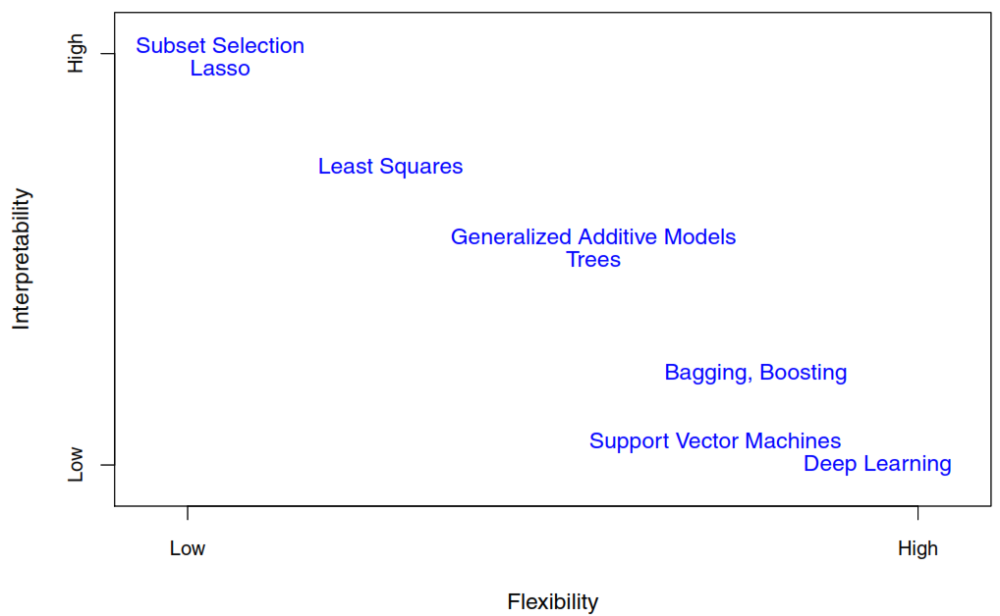
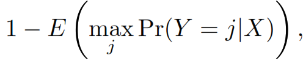

An Introduction to Statistical Learning
================

- <a href="#basic-concepts" id="toc-basic-concepts">1 Basic concepts</a>
  - <a href="#reducible-and-irreducible-error"
    id="toc-reducible-and-irreducible-error">1.1 Reducible and irreducible
    error</a>
  - <a href="#statistical-learning-methods"
    id="toc-statistical-learning-methods">1.2 Statistical learning methods</a>
  - <a href="#accuracy-vs-interpretability"
    id="toc-accuracy-vs-interpretability">1.3 Accuracy vs interpretability</a>
  - <a href="#evaluating-model-performance"
    id="toc-evaluating-model-performance">1.4 Evaluating model performance</a>

# Basic concepts

## Reducible and irreducible error

It is to estimate the next:

$$
Y = f(X) + \epsilon
$$

- **\$f\$ unknown function** of X1 , …, Xp
- **Random error (ϵ)**: independent of X and has mean zero. It also
  correspond to the **irreducible error** as it cannot be predicted
  using X. If the mean of ϵ isn’t zero it may contain unmeasured
  variables that are useful in predicting.

An error is **reducible** if we can improve the accuracy of \$\hat{f}\$
by using the most appropriate statistical learning technique to estimate
f.

$$
E(Y-\hat{Y})^2 = E[f(X) + \epsilon - \hat{f}(X)]^2 \\
= \underbrace{[f(X)- \hat{f}(x)]^2}_\text{Reducible} + 
  \underbrace{Var(\epsilon)}_\text{Irredicible}
$$

When general we don’t have any way to know how much of the error comes
from each source.

## Statistical learning methods

- **Parametric methods**
  1.  Make an assumption about the functional form. For example assuming
      linearity.
  2.  Estimates a small number parameters based on training data.
- **Non-parametric methods**
  1.  Don’t make an assumption about the functional form, to accurately
      fit a wider range of possible shapes for f.
  2.  Need a large number of observations in order to obtain an accurate
      estimate for f.
  3.  The data analyst must select a level of smoothness (degrees of
      freedom).

## Accuracy vs interpretability

## Evaluating model performance

we may have access to a set of observations that were not used to train
the statistical learning method. We can then simply evaluate on the test
observations, and select the learning method for which the **test MSE**
is smallest.

- **Test mean squared error (MSE)**

$$
Ave(y_{0}-\hat{f}(x_{0}))^2
$$

- **Bias-variance trade-off**

*The challenge lies in finding a method for which both the variance and
the squared bias are low.*

$$
E(y_{0} - \hat{f}(x_{0}))^2 = 
Var(\hat{f}(x_{0})) + 
[Bias(\hat{f}(x_{0}))]^2 + 
Var(\epsilon)
$$

- - **Variance** refers to the amount by which \$\hat{f}\$ would change
    if we estimated it using a different training data set. If a method
    has high variance then small changes in the training data can result
    in large changes in \$\hat{f}\$ .

  - **Squared bias** refers to the error that is introduced by
    approximating a real-life problem, which may be extremely
    complicated, by a much simpler model, like happens with linear
    models.

- **Test Error rate**

$$
Ave(I(y_{0} \neq \hat{y}_{0}))
$$

$$
\[ I(y_{0} \neq \hat{y}_{0}) = 
\begin{cases}
1 & \quand \text{If TRUE}\\
0 & \quand \text{If FALSE}
\]
$$

In this case the **Bayes Error Rate** is the **irreducible error** for
classifications, as we don’t know the distribution of Y given X.

**Cross-validation** is a method for estimating test MSE using the
training data.

- **Training data**: Data used to train, or teach, our method how to
  estimate f.
- **Overfitting**: Models follow the errors
