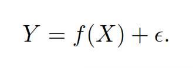
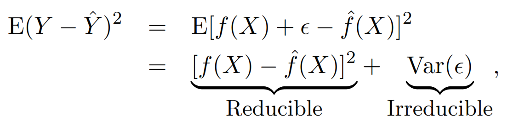
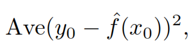
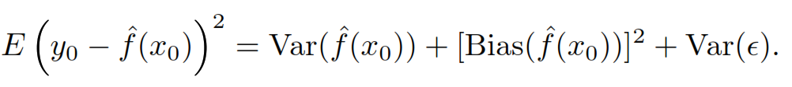

An Introduction to Statistical Learning
================
Angel Feliz

- <a href="#basic-concepts" id="toc-basic-concepts">1 Basic concepts</a>
  - <a href="#reducible-and-irreducible-error"
    id="toc-reducible-and-irreducible-error">1.1 Reducible and irreducible
    error</a>
  - <a href="#statistical-learning-methods"
    id="toc-statistical-learning-methods">1.2 Statistical learning methods</a>
  - <a href="#accuracy-vs-interpretability"
    id="toc-accuracy-vs-interpretability">1.3 Accuracy vs interpretability</a>
  - <a href="#evaluating-model-performance"
    id="toc-evaluating-model-performance">1.4 Evaluating model performance</a>

# Basic concepts

## Reducible and irreducible error

It is to estimate the next:

- **f unknown function** of X1,…,Xp
- **Random error (ϵ)**: independent of X and has mean zero. It also
  correspond to the **irreducible error** as it cannot be predicted
  using X. If the mean of ϵ isn’t zero it may contain unmeasured
  variables that are useful in predicting.

An error is **reducible** if we can improve the accuracy of ˆf by using
the most appropriate statistical learning technique to estimate f. 

When general we don’t have any way to know how much of the error comes
from each source.

## Statistical learning methods

- **Parametric methods**
  1.  Make an assumption about the functional form. For example assuming
      linearity.
  2.  Estimates a small number parameters based on training data.
- **Non-parametric methods**
  1.  Don’t make an assumption about the functional form, to accurately
      fit a wider range of possible shapes for f.
  2.  Need a large number of observations in order to obtain an accurate
      estimate for f.
  3.  The data analyst must select a level of smoothness (degrees of
      freedom).

## Accuracy vs interpretability

## Evaluating model performance

we may have access to a set of observations that were not used to train
the statistical learning method. We can then simply evaluate on the test
observations, and select the learning method for which the **test MSE**
is smallest.

- **Test mean squared error (MSE)**

- **Bias-variance trade-off**

*The challenge lies in finding a method for which both the variance and
the squared bias are low.*

- **Variance** refers to the amount by which ˆf would change if we
  estimated it using a different training data set. If a method has high
  variance then small changes in the training data can result in large
  changes in ˆf.

- **Squared bias** refers to the error that is introduced by
  approximating a real-life problem, which may be extremely complicated,
  by a much simpler model, like happens with linear models.

**Cross-validation** is a method for estimating test MSE using the
training data.

- **Training data**: Data used to train, or teach, our method how to
  estimate f. 
- **Overfitting**: Models follow the errors
