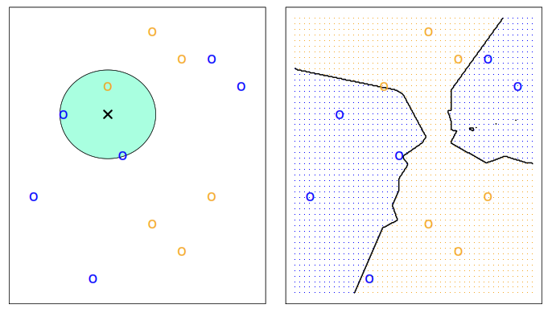
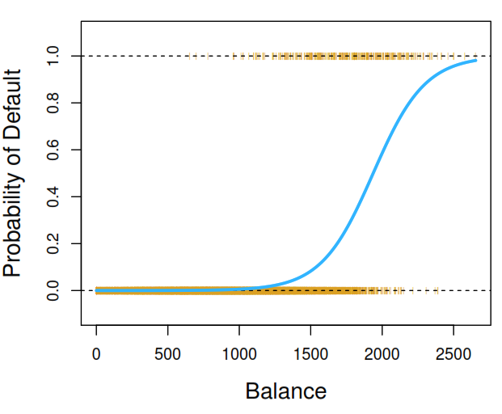
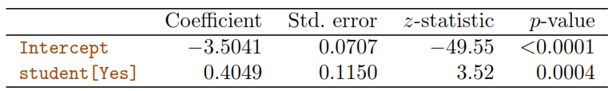
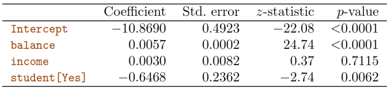
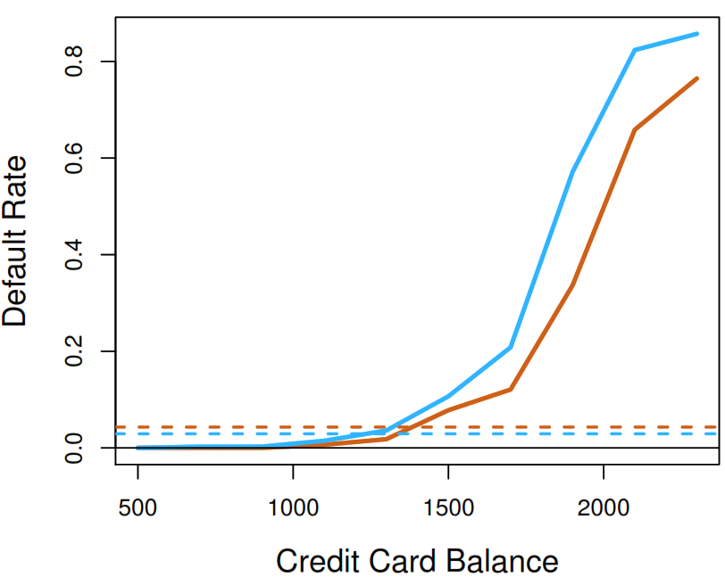
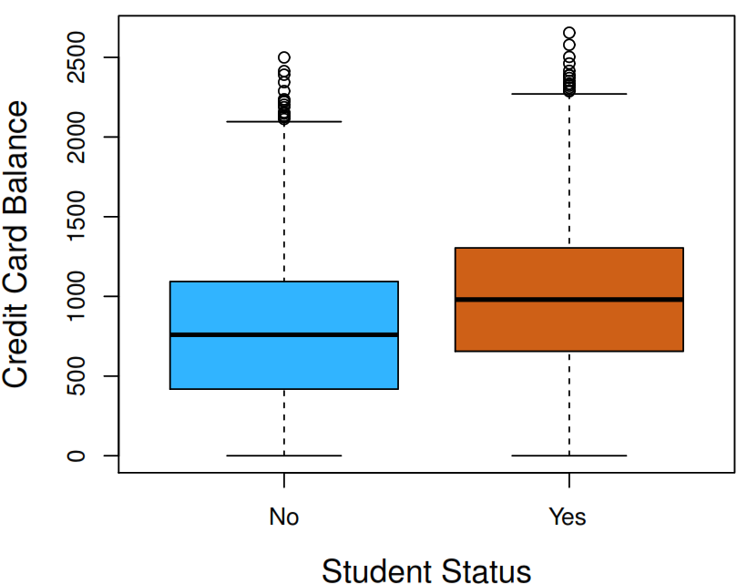

An Introduction to Statistical Learning
================

- <a href="#basic-concepts" id="toc-basic-concepts">1 Basic concepts</a>
  - <a href="#reducible-and-irreducible-error"
    id="toc-reducible-and-irreducible-error">1.1 Reducible and irreducible
    error</a>
  - <a href="#types-of-models" id="toc-types-of-models">1.2 Types of models</a>
  - <a href="#evaluating-model-performance"
    id="toc-evaluating-model-performance">1.3 Evaluating model performance</a>
- <a href="#linear-regresion" id="toc-linear-regresion">2 Linear regresion</a>
  - <a href="#getting-the-least-squares-line-of-a-sample"
    id="toc-getting-the-least-squares-line-of-a-sample">2.1 Getting the Least Squares Line of
    a sample</a>
  - <a href="#getting-confident-intervarls-of-coeffients"
    id="toc-getting-confident-intervarls-of-coeffients">2.2 Getting confident intervarls of
    coeffients</a>
  - <a href="#insights-to-extract" id="toc-insights-to-extract">2.3 Insights to extract</a>
    - <a href="#confirm-the-relationship-between-the-response-and-predictors"
      id="toc-confirm-the-relationship-between-the-response-and-predictors">2.3.1 Confirm the relationship between
      the Response and Predictors</a>
    - <a href="#accuracy-of-the-model-relationship-strength"
      id="toc-accuracy-of-the-model-relationship-strength">2.3.2 Accuracy of the model
      (relationship strength)</a>
    - <a
      href="#confirm-the-relationship-between-the-response-and-each-predictor"
      id="toc-confirm-the-relationship-between-the-response-and-each-predictor">2.3.3 Confirm the relationship between
      the Response and each predictor</a>
    - <a href="#size-of-association-between-each-predictor-and-the-response."
      id="toc-size-of-association-between-each-predictor-and-the-response.">2.3.4 Size of association between each
      predictor and the response.</a>
    - <a href="#predicting-future-values"
      id="toc-predicting-future-values">2.3.5 Predicting future values</a>
  - <a href="#standard-linear-regression-model-assumptions"
    id="toc-standard-linear-regression-model-assumptions">2.4 Standard linear regression model
    assumptions</a>
    - <a href="#including-an-interaction-term"
      id="toc-including-an-interaction-term">2.4.1 Including an interaction
      term</a>
    - <a href="#polynomial-regression" id="toc-polynomial-regression">2.4.2 Polynomial regression</a>
  - <a href="#possible-problems" id="toc-possible-problems">2.5 Possible problems</a>
    - <a href="#non-linearity-of-the-response-predictor-relationships"
      id="toc-non-linearity-of-the-response-predictor-relationships">2.5.1 Non-linearity of the
      response-predictor relationships</a>
    - <a href="#correlation-of-error-terms"
      id="toc-correlation-of-error-terms">2.5.2 Correlation of error terms</a>
    - <a href="#non-constant-variance-heteroscedasticity-of-error-terms"
      id="toc-non-constant-variance-heteroscedasticity-of-error-terms">2.5.3 Non-constant variance
      (heteroscedasticity) of error terms</a>
    - <a href="#outliers" id="toc-outliers">2.5.4 Outliers</a>
    - <a href="#high-leverage-points" id="toc-high-leverage-points">2.5.5 High-leverage points</a>
    - <a href="#collinearity" id="toc-collinearity">2.5.6 Collinearity</a>
  - <a href="#avoid-using-for-classification-problems"
    id="toc-avoid-using-for-classification-problems">2.6 Avoid using for classification
    problems</a>
- <a href="#k-nearest-neighbors-knn"
  id="toc-k-nearest-neighbors-knn">3 K-nearest neighbors (KNN)</a>
  - <a href="#classifier" id="toc-classifier">3.1 Classifier</a>
  - <a href="#regression" id="toc-regression">3.2 Regression</a>
- <a href="#logistic-regression" id="toc-logistic-regression">4 Logistic Regression</a>
  - <a href="#estimating-coefficients"
    id="toc-estimating-coefficients">4.1 Estimating coefficients</a>
  - <a href="#multiple-regression" id="toc-multiple-regression">4.2 Multiple regression</a>
  - <a href="#interpreting-the-model" id="toc-interpreting-the-model">4.3 Interpreting the model</a>
    - <a href="#understanding-a-confounding-paradox"
      id="toc-understanding-a-confounding-paradox">4.3.1 Understanding a confounding
      paradox</a>
  - <a href="#multinomial-logistic-regression"
    id="toc-multinomial-logistic-regression">4.4 Multinomial Logistic
    Regression</a>
  - <a href="#model-limitatios" id="toc-model-limitatios">4.5 Model limitatios</a>
- <a href="#generative-models-for-classification"
  id="toc-generative-models-for-classification">5 Generative Models for
  Classification</a>
  - <a href="#linear-discriminant-analysis-lda"
    id="toc-linear-discriminant-analysis-lda">5.1 Linear Discriminant Analysis
    (LDA)</a>

# Basic concepts

## Reducible and irreducible error

The goal when we are analyzing data is to find a function that based on
some Predictors and some random noise could explain the Response
variable.

$$
Y = f(X) + \epsilon
$$

**$\epsilon$** represent the **random error** and correspond to the
**irreducible error** as it cannot be predicted using the Predictors in
regression models. It would have a mean of 0 unless are missing some
relevant Predictors.

In classification models, the **irreducible error** is represented by
the **Bayes Error Rate**.

$$
1 -  E\left( 
     \underset{j}{max}Pr(Y = j|X)
     \right)
$$

An error is **reducible** if we can improve the accuracy of $\hat{f}$ by
using a most appropriate statistical learning technique to estimate $f$.

The challenge to achieve that goal it’s that we don’t at the beginning
how much of the error correspond to each type.

$$
\begin{split}
E(Y-\hat{Y})^2 & = E[f(X) + \epsilon - \hat{f}(X)]^2 \\
               & = \underbrace{[f(X)- \hat{f}(X)]^2}_\text{Reducible} +
                   \underbrace{Var(\epsilon)}_\text{Irredicible}
\end{split}
$$

The reducible error can be also spitted in two parts:

- **Variance** refers to the amount by which $\hat{f}$ would change if
  we estimate it using a different **training data set**. If a method
  has high variance then small changes in the training data can result
  in large changes of $\hat{f}$.

- **Squared bias** refers to the error that is introduced by
  approximating a real-life problem, which may be extremely complicated,
  by a much simpler model as for example a linear model.

$$
E(y_{0} - \hat{f}(x_{0}))^2 = 
Var(\hat{f}(x_{0})) + 
[Bias(\hat{f}(x_{0}))]^2 + 
Var(\epsilon)
$$

> **Note**
>
> Our challenge lies in finding a method for which both the variance and
> the squared bias are low.

## Types of models

- **Parametric methods**
  1.  Make an assumption about the functional form. For example,
      assuming linearity.
  2.  Estimate a small number parameters based on training data.
  3.  Are easy to interpret.
  4.  Tend to outperform non-parametric approaches when there is a small
      number of observations per predictor.
- **Non-parametric methods**
  1.  Don’t make an assumption about the functional form, to accurately
      fit a wider range of possible shapes for $f$.
  2.  Need a large number of observations in order to obtain an accurate
      estimate for $f$.
  3.  The data analyst must select a level of smoothness (degrees of
      freedom).

## Evaluating model performance

To evaluate how good works a models we need to split the available data
in two parts.

- **Training data**: Used to fit the model.
- **Test data**: Used to confirm how well the model works with new data.

Some measurements to evaluate our test data are:

- **Test mean squared error (MSE)**

$$
Ave(y_{0}-\hat{f}(x_{0}))^2
$$

- **Test error rate**

$$
I(y_{0} \neq \hat{y}_{0}) = 
\begin{cases}
    1 & \text{If } y_{0} \neq \hat{y}_{0} \\
    0 & \text{If } y_{0} = \hat{y}_{0}
\end{cases}
$$

$$
Ave(I(y_{0} \neq \hat{y}_{0}))
$$

# Linear regresion

## Getting the Least Squares Line of a sample

As the *population regression line* is unobserved the *least squares
line* of a sample is a good estimation. To get it we need to follow the
next steps:

1.  Define the function to fit.

$$
\hat{y} = \hat{\beta}_{0} + \hat{\beta}_{1} x
$$

2.  Define how to calculate **residuals**.

$$
e_{i} = y_{i} - \hat{y}_{i}
$$

3.  Define the **residual sum of squares (RSS)**.

$$
RSS = e_{1}^2 + e_{2}^2 + \dots + e_{n}^2
$$

4.  Use calculus or make estimation with a computer to find the
    coefficients that minimize the RSS.

$$
\hat{\beta}_{1} = \frac{\Sigma_{i=1}^{n}(x_{i}-\overline{x})(y_{i}-\overline{y})}
                       {\Sigma_{i=1}^{n}(x_{i}-\overline{x})}
, \quad
\hat{\beta}_{0} = \overline{y} - \hat{\beta}_{1}\overline{x}
$$

## Getting confident intervarls of coeffients

To estimate the **population regression line** we can calculate
**confidence intervals** for sample coefficients, to define a range where
we can find the population values with a defined **confidence level**.

> If we want to use 95% of confidence we need to know that after taking
> many samples only 95% of the intervals produced with this **confident
> level** would have the true value (parameter).

To generate confident intervals we would need to calculate the variance
of the *random error*.

$$
\sigma^2 = Var(\epsilon)
$$

But as we can not calculate that variance an alternative can be to
estimate it based on residuals if they meet the next conditions:

1.  Each residual have common variance $\sigma^2$, so the variances of
    the error terms shouldn’t have any relation with the value of the
    response.
2.  Residuals are uncorrelated. For example, if $\epsilon_{i}$ is
    positive, that provides little or no information about the sign of
    $\epsilon_{i+1}$.

If not, we would end underestimating the true standard errors, reducing
the probability a given confident level to contain the true value of the
parameter and underrating the *p-values* associated with the model.

$$
\sigma \approx RSE = \sqrt{\frac{RSS}{(n-p-1)}}
$$

Now we can calculate the **standard error** of each coefficient and
calculate the confident intervals.

$$
SE(\hat{\beta_{0}})^2 = \sigma^2 
                       \left[\frac{1}{n}+
                             \frac{\overline{x}^2}
                                  {\Sigma_{i=1}^{n} (x_{i}-\overline{x})^2} 
                       \right]
$$

$$
SE(\hat{\beta_{1}})^2 = \frac{\sigma^2}
                             {\Sigma_{i=1}^{n} (x_{i} - \overline{x})^2}
$$

$$  
\hat{\beta_{1}} \pm 2 \cdot SE(\hat{\beta_{1}}), \quad \hat{\beta_{0}} \pm 2 \cdot SE(\hat{\beta_{0}})
$$

## Insights to extract

### Confirm the relationship between the Response and Predictors

Use the regression **overall P-value** (based on the F-statistic) to
confirm that at **least one predictor** is related with the Response and
avoid interpretative problems associated with the number of observations
(*n*) or predictors (*p*).

$$
H_{0}: \beta_{1} = \beta_{2} = \dots = \beta_{p} = 0
$$

$$
H_{a}: \text{at least one } \beta_{j} \text{ is non-zero}
$$

### Accuracy of the model (relationship strength)

If we want to know how well the model fits to the data we have two
options:

- **Residual standard error (RSE)**: Even if the model were correct, the
  actual values of $\hat{y}$ would differ from the true regression line
  by approximately *this units*, on average. To get the percentage error
  we can calculate $RSE/\overline{x}$

- **The $R^2$ statistic**: The proportion of variance explained by
  taking as a reference the **total sum of squares (TSS)**.

$$
TSS = \Sigma(y_{i} - \overline{y})^2
$$

$$
R^2 = \frac{TSS - RSS}{TSS}
$$

$$
R^2 = 
\begin{cases}
    Cor(X, Y)^2  & \text{Simple Lineal Regresion} \\
    Cor(Y,\hat{Y})^2 & \text{Multipline Lineal Regresion}
\end{cases}
$$

### Confirm the relationship between the Response and each predictor

To answer that we can test if a particular subset of q of the
coefficients are zero.

$$
H_{0}: \beta_{p-q+1} = \beta_{p-q+2} = \dots = \beta_{p} = 0
$$

In this case, F-statistic reports the **partial effect** of adding a
extra variable to the model (the order matters) to apply a *variable
selection* technique. The classical approach is to:

1.  Fit a model for each variable combination $2^p$.
2.  Select the best model based on *Mallow’s Cp*, *Akaike information
    criterion (AIC)*, *Bayesian information criterion (BIC)*, and
    *adjusted* $R^2$ or plot various model outputs, such as the
    residuals, in order to search for patterns.

But just think that if we have $p = 30$ we will have
$2^{30} = =1,073,741,824\ models$ to fit, that it’s too much. Some
alternative approaches for this task:

- Forward selection
- Backward selection (cannot be used if p \>n)
- Mixed selection

### Size of association between each predictor and the response.

To check that we need to see the $\hat{\beta}_{j}$ *confident intervals*
as the real $\beta_{j}$ is in that range.

### Predicting future values

If we want to predict the average response $f(X)$ we can use the
confident intervals, but if we want to predict an individual response
$Y = f(X) + \epsilon$ we need to use prediction intervals as they
account for the uncertainty associated with $\epsilon$, the irreducible
error.

## Standard linear regression model assumptions

- The **additivity assumption** means that the association between a
  predictor $X_{j}$ and the response $Y$ does not depend on the values
  of the other predictors, as it happens when there is a *interaction
  (synergy) effect*

- The **linearity assumption** states that the change in the response Y
  associated with a one-unit change in $X_{j}$ is constant, regardless
  of the value of $X_{j}$.

### Including an interaction term

This approach relax the *additivity assumption* that models usually
have.

- **2 quantitative variables**

It consist in adding an extra coefficient which multiplies two or more
variables.

$$
\begin{split}
Y & = \beta_{0} + \beta_{1} X_{1} + \beta_{2} X_{2} + \beta_{3} X_{1} X_{2} + \epsilon \\
  & = \beta_{0} + (\beta_{1} + \beta_{3} X_{2}) X_{1} + \beta_{2} X_{2} + \epsilon \\
  & = \beta_{0} + \tilde{\beta}_{1} X_{1} + \beta_{2} X_{2} + \epsilon
\end{split}
$$

After adding the interaction term we could interpret the change as
making one of the original coefficient a function of the another
variable. Now we could say that $\beta_{3}$ *represent **the change
of*** $X_{1}$ ***effectiveness** associated with a one-unit increase in*
$X_{2}$.

It very important that we keep **hierarchical principle**, which states
that if we include an interaction in a model, we should also include the
main effects, even if the p-values associated with their coefficients
are not significant as ***it would alter the meaning of the
interaction***.

- **1 quantitative and 1 qualitative variable**

If $X_{1}$ is quantitative and $X_{2}$ is qualitative:

$$
\hat{Y} = 
\begin{cases}
    (\beta_{0} + \beta_{2}) + (\beta_{1} + \beta_{3})X_{1} & \text{if }X_{2} \text{ is TRUE}\\
    \beta_{0} + \beta_{1}X_{1}                             & \text{if }X_{2} \text{ is FALSE}
\end{cases}
$$

Adding the $\beta_{3}$ interaction allow the line to change the line
slope based on $X_{2}$ and not just a different intercept.

### Polynomial regression

This approach relax the *linearity assumption* that models usually have.
It consist in including transformed versions of the predictors.

$$
\begin{split}
Y & = \beta_{0} + \beta_{1} X_{1} + \beta_{2} X_{2} \\
  & = \beta_{0} + \beta_{1} X_{1} + \beta_{2} X_{1}^2 
\end{split}
$$

## Possible problems

### Non-linearity of the response-predictor relationships

| Detection method                                                                                                                                                                                                  | Solutions                                                                                                                                   |
|:------------------------------------------------------------------------------------------------------------------------------------------------------------------------------------------------------------------|:--------------------------------------------------------------------------------------------------------------------------------------------|
| Plot the **residuals versus predicted values** $\hat{y}_{i}$. Ideally, the residual plot will show no discernible pattern. The presence of a pattern may indicate a problem with some aspect of the linear model. | A simple approach is to use non-linear transformations of the predictors, such as $\log{X}$, $\sqrt{X}$, and $X^2$, in the regression model |

### Correlation of error terms

| Detection method                                                                                                                                                                                                                                          | Solutions                                                               |
|:----------------------------------------------------------------------------------------------------------------------------------------------------------------------------------------------------------------------------------------------------------|:------------------------------------------------------------------------|
| 1\. Plot the residuals from our model as a function of time or execution order. If the errors are uncorrelated, then there should be no discernible pattern.     2. Check if some observation have been exposed to the same environmental factors | Good experimental design is crucial in order to mitigate these problems |

### Non-constant variance (heteroscedasticity) of error terms

| Detection method                                              | Solutions                                                                              |
|:--------------------------------------------------------------|:---------------------------------------------------------------------------------------|
| Plot the residual plot en check if you can see a funnel shape | We can transform the response using a concave function such as $\log{Y}$ or $\sqrt{Y}$ |

### Outliers

An outlier is a point for which $y_{i}$ is far from the value predicted
by the model. Sometimes, they have little effect on the least squares
line, but *over estimate the RSE* making bigger p-values of the model
and *under estimate the* $R^2$.

| Detection method                                                                                                                                                              | Solutions                                                                                                                                                         |
|:------------------------------------------------------------------------------------------------------------------------------------------------------------------------------|:------------------------------------------------------------------------------------------------------------------------------------------------------------------|
| Plot the **studentized residuals**, computed by dividing each residual $e_{i}$ by its estimated standard error. Then search for points which absolute value is greater than 3 | They can be removed if it has occurred due to an error in data collection. Otherwise, they may indicate a deficiency with the model, such as a missing predictor. |

### High-leverage points

Observations with **high leverage** have an unusual value for $x_{i}$.
High leverage observations tend to have a sizable impact on the
estimated regression line and any problems with these points may
invalidate the entire fit.

| Detection method                                                                                                                                              | Solutions                                                             |
|:--------------------------------------------------------------------------------------------------------------------------------------------------------------|:----------------------------------------------------------------------|
| Compute the leverage statistic. Find an observation with higher value than mean, represented by $(p + 1)/n$. Leverage values are always between $1/n$ and $1$ | Make sure that the value is correct and not a data collection problem |

$$
h_{i} = \frac{1}{n} + 
        \frac{(x_{i} - \overline{x})^2}
              {\Sigma_{i'=1}^n(x_{i'} - \overline{x})^2}
$$

In a *multiple linear regression*, it is possible to have an observation
that is well within the range of each individual predictor’s values, but
that is unusual in terms of the full set of predictors.

### Collinearity

**Collinearity** refers to the situation in which two or more predictor
variables are closely related (highly correlated) to one another. It
reduces the accuracy of the estimates of the regression coefficients and
causes the standard error for $\hat{\beta}_{j}$ to grow. That reduce the
**power of the hypothesis test**,that is, the probability of correctly
detecting a non-zero coefficient.

Looking at the correlation matrix of the predictors could be usefull,
but it is possible for collinearity to exist between three or more
variables even if no pair of variables has a particularly high
correlation (**multicollinearity**).

| Detection method                                                                                                                                                                                                                                                                                                             | Solutions                                                                                                                                      |
|:-----------------------------------------------------------------------------------------------------------------------------------------------------------------------------------------------------------------------------------------------------------------------------------------------------------------------------|:-----------------------------------------------------------------------------------------------------------------------------------------------|
| The best way to assess multicollinearity is to compute the **variance inflation factor (VIF)**, which is the ratio of the variance of $\hat{\beta}_{j}$ when fitting the full model divided by the variance of $\hat{\beta}_{j}$ if fit on its own with 1 as its lowest value and 5 or 10 as problematic values of collinearity | 1\. Drop one of the problematic variables from the regression.     2. Combine the collinear variables together into a single predictor |

$$
\text{VIF}(\hat{\beta}_{j}) = \frac{1}
                                   {1 - R_{X_{j}|X_{-j}}^2}
$$

Where $R_{X_{j}|X_{-j}}^2$ is the $R^2$ from a regression of $X_{j}$
onto all of the other predictors.

## Avoid using for classification problems

There are better model to achieve that kind of situation. For example,
he linear **discriminant analysis (LDA)** procedure the same response of
a linear regression for a binary problem. Other reasons are:

- A regression method cannot accommodate a qualitative response with
  more than two classes.
- A regression method will not provide meaningful estimates of $Pr(Y|X)$
  as some of our estimates might be outside the \[0, 1\] interval.

# K-nearest neighbors (KNN)

This method performs worst than a parametric as we starting adding
*noise* predictors. In fact, we will get in the situation where for a
given observation has no *nearby neighbors*, known as **curse of
dimensionality** and leading to a very poor prediction of $f(x_{0})$.

## Classifier

The next function estimates the conditional probability for class $j$ as
the fraction of points in $N_{0}$ whose response values equal $j$.

$$
\text{Pr}(Y = j|X = x_{0}) = \frac{1}{K} 
                      \displaystyle\sum_{i \in N_{0}} I(y_{i} = j)
$$

- Where
  - $j$ response value to test
  - $x_{0}$ is the test observation
  - $K$ the number of points in the training data that are closest to
    $x_{0}$ and reduce the model flexibility
  - $N_{0}$ points in the training data that are closest to $x_{0}$

Then KNN classifies the test observation $x_{0}$ to the class with the
largest probability.

## Regression

KNN regression estimates $f(x_{0})$ using the average of all the
training responses in $N_{0}$.

$$
\hat{f}(x_{0}) = \frac{1}{K} 
                      \displaystyle\sum_{i \in N_{0}} y_{i}
$$

- Where
  - $x_{0}$ is the test observation
  - $K$ the number of points in the training data that are closest to
    $x_{0}$ and reduce the model flexibility
  - $N_{0}$ points in the training data that are closest to $x_{0}$

# Logistic Regression

It models the **probability** ($p(X) = Pr(Y=1|X)$) that Y belongs to a
particular category given some predictors. This model just support
classifications between to categories and calculate the probability
using the ***logistic function*** which produce a S form between 0 and
1:

$$
p(X) = \frac{e^{\beta_{0}+\beta_{1}X}}
            {1+e^{\beta_{0}+\beta_{1}X}}
$$

As the functions returns probabilities is responsibility of the analyst
to define a **threshold** to make classifications.

## Estimating coefficients

To estimate $\hat{\beta}_{0}$ and $\hat{\beta}_{1}$ the method used is
called as *maximum likelihood* which consists in maximizing the
**likelihood function**. It is important to clarify that the *least
squares approach* is in fact a special case of maximum likelihood.

$$
\ell(\beta_{0}, \beta_{1}) = \prod_{i:y_{i} = 1}p(x_{i})\prod_{i':y_{i'} = 0}p(1-x_{i'})
$$

## Multiple regression

We also can generalize the *logistic function* as you can see bellow.

$$
p(X) = \frac{e^{\beta_{0}+\beta_{1}X_{1}+\dots+\beta_{p}X_{p}}}
            {1+e^{\beta_{0}+\beta_{1}X_{1}+\dots+\beta_{p}X_{p}}}
$$

## Interpreting the model

To understand how each variable influence the probability $p(X)$, we
need to manipulate the *logistic function* until having a lineal
combination on the right site.

$$
\underbrace{ \log{ \left( \overbrace{\frac{p(X)}{1 - p(X)}}^\text{odds ratio} \right)} }_\text{log odds or logit} = \beta_{0}+\beta_{1}X 
$$ As we can see, the result of the linear combination is the $\log$ of
the *odds ratio*, known as **log odd** or **logit**.

An **odds ratio** of an event presents the likelihood that the event
will occur as a proportion of the likelihood that the event won’t occur.
It can take any value between $0$ and $\infty$, where low probabilities
are close to $0$, higher to $\infty$ and equivalents ones are equals
to 1. For example, if we have an $\text{odds ratio} = 2$, we can say
that it’s 2 times more likely that the event happens rather than not.

Applying $\log{(\text{odds ratio})}$ makes easier to compare the effect
of variables as values below 1 become negative numbers of the scale of
possible numbers and 1 becomes 0 for non-significant ones. To have an
idea, an odds ratio of 2 has the same effect as 0.5, which it’s hard to
see at first hand, but if we apply the $\log$ to each value we can see
that $\log{(2)} = 0.69$ and $\log{(0.5)} = -0.69$.

At end, $p(X)$ will increase as $X$ increases if $\beta_{1}$ is positive
despite the relationship between each other isn’t a linear one.

### Understanding a confounding paradox

| Simple Regression                                                                                                                                          | Multiple Regression                                                                                                                                   |
|:-----------------------------------------------------------------------------------------------------------------------------------------------------------|:------------------------------------------------------------------------------------------------------------------------------------------------------|
|                                                                                          |                                                                                     |
| The positive coefficient for student indicates that for **over all values of balance and income**, a student is *more* likely to default than a non-student. | The negative coefficient for student indicates that for a **fixed value of balance and income**, a student is less likely to default than a non-student. |

The problem relays on the fact that *student* and *balance* are
**correlated**. In consequence, a student is riskier than a non-student
if no information about the student’s credit card balance is available.
However, that student is less risky than a non-student with the *same
credit card balance*!

## Multinomial Logistic Regression

We also can generalize the *logistic function* to support more than 2
categories ($K > 2$) by defining by convention the last category $K$ as
a **baseline**.

For $k = 1, \dotsc,K-1$ we use function.

$$
Pr(Y = k|X= x) = \frac{e^{\beta_{k0}+\beta_{k1}x_{1}+\dots+\beta_{kp}x_{p}}}
                      {1+\sum_{l=1}^{K-1}e^{\beta_{l0}+\beta_{l1}x_{1}+\dots+\beta_{lp}x_{p}}}
$$

For $k=K$, we use the function.

$$
Pr(Y = K|X= x) = \frac{1}
                      {1+\sum_{l=1}^{K-1}e^{\beta_{l0}+\beta_{l1}x_{1}+\dots+\beta_{lp}x_{p}}}
$$ And after some manipulations we can show that $\log$ of the
probability of getting $k$ divided by the probability of the *baseline*
is equivalent to a linear combinations of the functions parameters.

$$
\log{ \left( \frac{Pr(Y = k|X= x)}{Pr(Y = K|X= x)} \right)} = \beta_{k0}+\beta_{k1}x_{1}+\dots+\beta_{kp}x_{p}
$$

In consequence, each coefficient represent a measure of how much change
the probability from the baseline probability.

## Model limitatios

There are models that could make better classifications when:

- There is a substantial separation between the $Y$ classes.
- The predictors $X$ are approximately normal in each class and the
  sample size is small.

# Generative Models for Classification

These models instead of trying to predict the **posterior probability**
( $Pr(Y=k|X=x)$ ) directly, they try to estimate the distribution of the
predictors $X$ separately in each of the response classes $Y$ (
$f_{k}(X) = Pr(X|Y=k)$ ). Then, they use the **Bayes’ Theorem** and the
**overall or prior probability** $\pi_{k}$ (probability of a randomly
chosen observation comes from the $k$th class) to flip these around into
estimates for $Pr(Y=k|X=x)$.

$$
p_{k}(x) = Pr(Y = k | X = x) = \frac{\pi_{k} f_{k}(x)} {\sum_{l=1}^{K} \pi_{l} f_{l}(x)}
$$ As estimating the density function $f_{k}$ it’s challenging models
make some simplifying assumptions to estimate it.

## Linear Discriminant Analysis (LDA)

This model assumes that $f_{k}$ follow a **Normal (Gaussian)
distribution** within each class.

If we have a problem, where $X = x$ and
$\hat{\sigma}_{1}^2 = \dots = \hat{\sigma}_{k}^2$, we can estimate the
mean $\hat{\mu}_{k}$ and the variance $\hat{\sigma}^2$ for $x$ and
calculate $\hat{\pi}_{k} = n_{k}/ n$ for each $Y$ class. Then we can
apply the log of $p_{k}(x)$ to represent the **discriminant function**:

\$\$ \_{k} (x) = x  -  +

\$\$

In this functions it’s clear that a class has more possibilities to be
selected as mean for that particular class increases and its variance
decreases.

To use this model with more than one predictor we need to assume that: -
Each individual predictor follows a one-dimensional normal
distribution - There is some correlation between each pair of predictors
