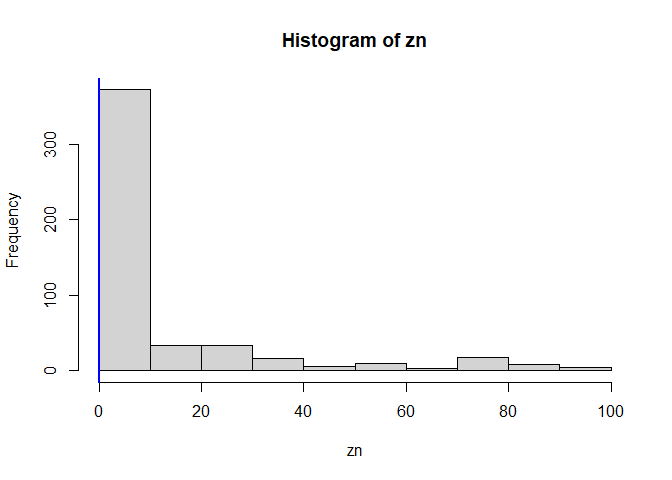
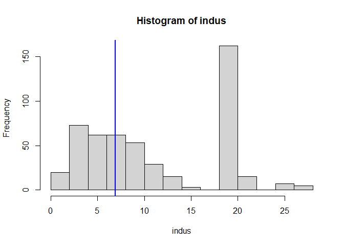
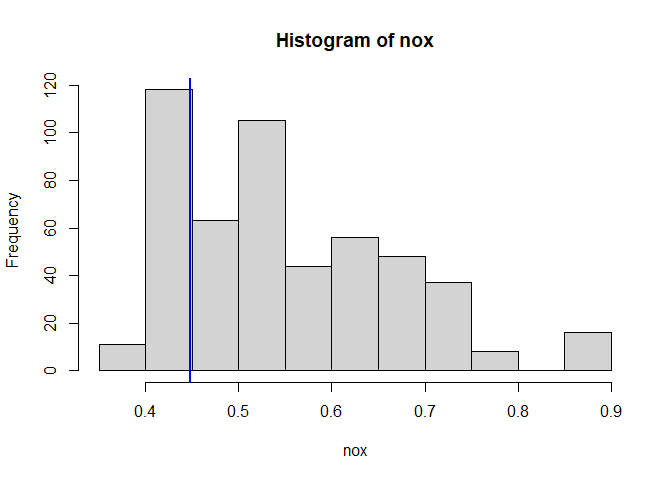
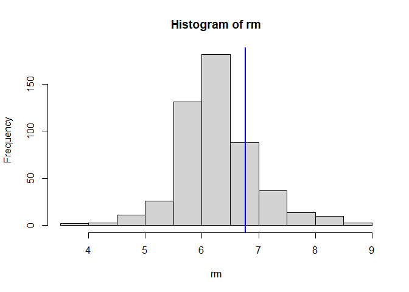
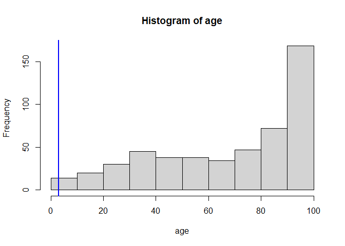

02-execises
================

- <a href="#conceptual" id="toc-conceptual"><span
  class="toc-section-number">1</span> Conceptual</a>
- <a href="#applied" id="toc-applied"><span
  class="toc-section-number">2</span> Applied</a>

## Conceptual

1.  **For each of parts (a) through (d), indicate whether we would
    generally expect the performance of a flexible statistical learning
    method to be better or worse than an inflexible method. Justify your
    answer.**

- **The sample size n is extremely large, and the number of predictors p
  is small.**

Better, flexible models reduce bias and quit the variance low when
having a large n.

- **The number of predictors p is extremely large, and the number of
  observations n is small.**

Worse, a flexible model could increase its variance very high when
having small n.

- **The relationship between the predictors and response is highly
  non-linear.**

Better, a lineal model would have a very high bias in this case.

- **The variance of the error terms, i.e. σ2 = Var(ϵ), is extremely
  high.**

Worse, a flexible model would over-fit trying to follow the irreducible
error.

2.  **Explain whether each scenario is a classification or regression
    problem, and indicate whether we are most interested in inference or
    prediction. Finally, provide n and p.**

- **We collect a set of data on the top 500 firms in the US. For each firm
  we record profit, number of employees, industry and the CEO salary. We
  are interested in understanding which factors affect CEO salary.**

Regression, inference, 500, 4

- **We are considering launching a new product and wish to know whether
  it will be a success or a failure. We collect data on 20 similar
  products that were previously launched. For each product we have
  recorded whether it was a success or failure, price charged for the
  product, marketing budget, competition price, and ten other
  variables.**

Classification, prediction, 20, 14

- **We are interested in predicting the % change in the USD/Euro
  exchange rate in relation to the weekly changes in the world stock
  markets. Hence we collect weekly data for all of 2012. For each week
  we record the % change in the USD/Euro, the % change in the US market,
  the % change in the British market, and the % change in the German
  market.**

Regression, prediction, 52, 4

3.  **We now revisit the bias-variance decomposition.**

- **Provide a sketch of typical (squared) bias, variance, training
  error, test error, and Bayes (or irreducible) error curves, on a
  single plot, as we go from less flexible statistical learning methods
  towards more flexible approaches. The x-axis should represent the
  amount of flexibility in the method, and the y-axis should represent
  the values for each curve. There should be five curves. Make sure to
  label each one.**


- **Explain why each of the five curves has the shape displayed in part
  (a).**

In the example f isn’t lineal, so the the **test error** lower as we add
flexibility until the point the models starts to overfit. The **training
error** always goes down as we increase the flexibility. As we make the
model more flexible **variance** always increase as the model is more
likely to change as we change the training data and the **bias** always
goes down as a more flexible model has fewer assumptions. The **Bayes
error** is the irreducible error we can not change it.

4.  **You will now think of some real-life applications for statistical
    learning.**

- **Describe three real-life applications in which classification might
  be useful. Describe the response, as well as the predictors. Is the
  goal of each application inference or prediction? Explain your
  answer.**

|   Goal    | Response                      | Predictors                                                                                                                                                                                          |
|:---------:|:------------------------------|:----------------------------------------------------------------------------------------------------------------------------------------------------------------------------------------------------|
| Inference | Customer Tower Churn (0 or 1) | Annual Rent, Tower Lat, Tower Log, Tower Type, Number of sites around 10 km, Population around 10 km, Average Annual Salary in the city, contract Rent increases, customer technology               |
| Inference | Employee Churn (0 or 1)       | Months in company, Salary, Number of positions, Major, Sex, Total Salary Change, Bono, Wellness Expend, Number of depends, Home location                                                            |
| Inference | Absent (0 or 1)               | Salary, Rain?, Holiday?, Number of uniforms, distance from home to work place, Months in company, Neighborhood median Salary, number of depends, number of marriage, Work start, Work End, Free day |

- **Describe three real-life applications in which regression might be
  useful. Describe the response, as well as the predictors. Is the goal
  of each application inference or prediction? Explain your answer.**

|   Goal    | Response                          | Predictors                                                                                                                   |
|:---------:|:----------------------------------|:-----------------------------------------------------------------------------------------------------------------------------|
| Inference | Number of likes                   | Words, Has a video?, Has a picture?, Post time, hashtag used                                                                 |
| Inference | Velocidad de picheo               | Edad, Altura, Peso, Horas de corrida, Cantidad de sentadillas, cantidad de practicas por semana, Años practicando el deporte |
| Inference | Food Satisfaction level (0 to 10) | Country, City, Height, Weight, Salary (US \$), Salt, Spacy Level, Sugar (gr), Meat Type, Cheese (gr), Cheese Type            |

- **Describe three real-life applications in which cluster analysis
  might be useful.**

|                                Goal                                | Predictors                                                                                                                                           |
|:------------------------------------------------------------------:|------------------------------------------------------------------------------------------------------------------------------------------------------|
|              Classify costumer to improve advertising              | Words searched, products clicked, Explored image, Seconds spent on each product, start time, end time, customer location                             |
|        Classify company towers to see patterns in customers        | Tower Lat, Tower Log, Tower Type, Number of sites around 10 km, Population around 10 km, Average Annual Salary in the city, BTS?, start date, Height |
| Classify football players check which players have similar results | Number of passes on each game, Number of meters run on each game, Position Played, Number of goals, Number of stolen balls, total time played        |

5.  **What are the advantages and disadvantages of a very flexible
    (versus a less flexible) approach for regression or classification?
    Under what circumstances might a more flexible approach be preferred
    to a less flexible approach? When might a less flexible approach be
    preferred?**

- Flexible model advantages
  - They have the potential to accurately fit a wider range of possible
    shapes for f
- Flexible model disadvantages
  - They do not reduce the problem of estimating f to a small number of
    parameters.
  - A very large number of observations is required in order to obtain
    an accurate estimate for f.
  - They are harder to interpret

It is preferred when we have a lot of data to train the model and the
goal is to get accurate predictions rather than good interpretations.

A less flexible approach is preferred when we don’t have a lot data to
train the model or when the main goal is to make inferences to
understand business rules.

6.  **Describe the differences between a parametric and a non-parametric
    statistical learning approach. What are the advantages of a
    parametric approach to regression or classification (as opposed to a
    nonparametric approach)? What are its disadvantages?**

| Parametric                                                 | Non-parametric                                                                                                |
|:-----------------------------------------------------------|:--------------------------------------------------------------------------------------------------------------|
| Make an assumption about the functional form               | Don’t make an assumption about the functional form, to accurately fit a wider range of possible shapes for $f$ |
| Estimates a small number parameters based on training data | Estimates a large number parameters based on training data                                                    |
| Can be trained with few examples                           | Needs many examples to be trained                                                                             |
| Smoothness level is fixed                                  | Data analyst needs define a level of smoothness                                                               |

- Parametric model advantages
  - Reduce the problem of estimating f to a small number of parameters.
  - Can be trained with few examples.
  - They are easy to interpret.
- Parametric model disadvantages
  - In many times $f$ doesn’t have the assumed shape adding a lot of
    bias to the model.

7.  **The table below provides a training data set containing six
    observations, three predictors, and one qualitative response
    variable.**

``` r
DF_07 <-
  data.frame(X1 = c(0,2,0,0,-1,1),
             X2 = c(3,0,1,1,0,0),
             X3 = c(0,0,3,2,1,1),
             Y = c("Red","Red","Red","Green","Green","Red"))

DF_07
```

      X1 X2 X3     Y
    1  0  3  0   Red
    2  2  0  0   Red
    3  0  1  3   Red
    4  0  1  2 Green
    5 -1  0  1 Green
    6  1  0  1   Red

**Suppose we wish to use this data set to make a prediction for Y when
X1 = X2 = X3 = 0 using K-nearest neighbors.**

- **Compute the Euclidean distance between each observation and the test
  point, X1 = X2 = X3 = 0.**

``` r
# As (C - 0)^2 = C^2

DF_07 <- transform(DF_07, dist = sqrt(X1^2+X2^2+X3^2))
```

- **What is our prediction with K = 1? Why?**

``` r
DF_07[order(DF_07$dist),]
```

      X1 X2 X3     Y     dist
    5 -1  0  1 Green 1.414214
    6  1  0  1   Red 1.414214
    2  2  0  0   Red 2.000000
    4  0  1  2 Green 2.236068
    1  0  3  0   Red 3.000000
    3  0  1  3   Red 3.162278

In the is case, the point would be in the Bayes decision boundary as
there are two points of different colors at the same distance.

- **What is our prediction with K = 3? Why?**

In this case, the point would be a **Red** one as 2 of 3 of them are
from that color.

- **If the Bayes decision boundary in this problem is highly nonlinear,
  then would we expect the best value for K to be large or small? Why?**

As flexibility decrease as K gets bigger, for highly nonlinear Bayes
decision boundary the best K value should be a small one.

## Applied

8.  **This exercise relates to the College data set, which can be found
    in the file College.csv on the book website. It contains a number of
    variables for 777 different universities and colleges in the US**

**Before reading the data into R, it can be viewed in Excel or a text
editor.**

- **Use the read.csv() function to read the data into R. Call the loaded
  data college. Make sure that you have the directory set to the correct
  location for the data. You should notice that the first column is just
  the name of each university. We don’t really want R to treat this as
  data.**

``` r
college <- 
  read.csv(here::here("chapters/02-chapter/College.csv"), 
           row.names = 1, stringsAsFactors = TRUE)
```

- **Use the summary() function to produce a numerical summary of the
  variables in the data set.**

``` r
summary(college)
```

     Private        Apps           Accept          Enroll       Top10perc    
     No :212   Min.   :   81   Min.   :   72   Min.   :  35   Min.   : 1.00  
     Yes:565   1st Qu.:  776   1st Qu.:  604   1st Qu.: 242   1st Qu.:15.00  
               Median : 1558   Median : 1110   Median : 434   Median :23.00  
               Mean   : 3002   Mean   : 2019   Mean   : 780   Mean   :27.56  
               3rd Qu.: 3624   3rd Qu.: 2424   3rd Qu.: 902   3rd Qu.:35.00  
               Max.   :48094   Max.   :26330   Max.   :6392   Max.   :96.00  
       Top25perc      F.Undergrad     P.Undergrad         Outstate    
     Min.   :  9.0   Min.   :  139   Min.   :    1.0   Min.   : 2340  
     1st Qu.: 41.0   1st Qu.:  992   1st Qu.:   95.0   1st Qu.: 7320  
     Median : 54.0   Median : 1707   Median :  353.0   Median : 9990  
     Mean   : 55.8   Mean   : 3700   Mean   :  855.3   Mean   :10441  
     3rd Qu.: 69.0   3rd Qu.: 4005   3rd Qu.:  967.0   3rd Qu.:12925  
     Max.   :100.0   Max.   :31643   Max.   :21836.0   Max.   :21700  
       Room.Board       Books           Personal         PhD        
     Min.   :1780   Min.   :  96.0   Min.   : 250   Min.   :  8.00  
     1st Qu.:3597   1st Qu.: 470.0   1st Qu.: 850   1st Qu.: 62.00  
     Median :4200   Median : 500.0   Median :1200   Median : 75.00  
     Mean   :4358   Mean   : 549.4   Mean   :1341   Mean   : 72.66  
     3rd Qu.:5050   3rd Qu.: 600.0   3rd Qu.:1700   3rd Qu.: 85.00  
     Max.   :8124   Max.   :2340.0   Max.   :6800   Max.   :103.00  
        Terminal       S.F.Ratio      perc.alumni        Expend     
     Min.   : 24.0   Min.   : 2.50   Min.   : 0.00   Min.   : 3186  
     1st Qu.: 71.0   1st Qu.:11.50   1st Qu.:13.00   1st Qu.: 6751  
     Median : 82.0   Median :13.60   Median :21.00   Median : 8377  
     Mean   : 79.7   Mean   :14.09   Mean   :22.74   Mean   : 9660  
     3rd Qu.: 92.0   3rd Qu.:16.50   3rd Qu.:31.00   3rd Qu.:10830  
     Max.   :100.0   Max.   :39.80   Max.   :64.00   Max.   :56233  
       Grad.Rate     
     Min.   : 10.00  
     1st Qu.: 53.00  
     Median : 65.00  
     Mean   : 65.46  
     3rd Qu.: 78.00  
     Max.   :118.00  

- **Use the pairs() function to produce a scatterplot matrix of the first
  ten columns or variables of the data. **

``` r
pairs(college[,1:10])
```


- **Use the plot() function to produce side-by-side boxplots of Outstate
  versus Private.**

``` r
plot(college$Private, college$Outstate)
```


- **Create a new qualitative variable, called Elite, by binning the
  Top10perc variable. We are going to divide universities into two
  groups based on whether or not the proportion of students coming from
  the top 10 % of their high school classes exceeds 50 %.**

``` r
college$Elite <- ifelse(college$Top10perc > 50, "Yes", "No") |> as.factor()
```

- **Then Use the summary() function to see how many elite universities
  there are.**

``` r
summary(college$Elite)
```

     No Yes 
    699  78 

- **Now use the plot() function to produce side-by-side boxplots of
  Outstate versus Elite.**

``` r
plot(college$Elite, college$Outstate)
```


- **Use the hist() function to produce some histograms with differing
  numbers of bins for a few of the quantitative variables. You may find
  the command par(mfrow = c(2, 2)) useful: it will divide the print
  window into four regions so that four plots can be made
  simultaneously. Modifying the arguments to this function will divide
  the screen in other ways.**

``` r
par(mfrow = c(3, 1))

hist(college$Apps)
hist(college$Accept)
hist(college$Enroll)
```


- **Continue exploring the data, and provide a brief summary of what you
  discover.**

``` r
par(mfrow = c(2, 2))

plot(college$S.F.Ratio, college$Expend)
plot(college$S.F.Ratio, college$Outstate)
plot(college$Top10perc, college$Terminal)
plot(college$Top10perc, college$Room.Board)
```


``` r
par(mfrow = c(1, 1))
```

As students have more resources like teaching, supervision, curriculum
development, and pastoral support institutions tend to expend less on
each student and quest less money from out state students.

We also can see that students from top 10 % of high school class tend to
go to universities where most the professors have the highest academic
level available for each field or the highest room and board costs

9.  **This exercise involves the Auto data set studied in the lab. Make
    sure that the missing values have been removed from the data.**

- **Which of the predictors are quantitative, and which are
  qualitative?**

``` r
library(ISLR2)
```

    Warning: package 'ISLR2' was built under R version 4.2.2

``` r
quantitative_vars <-
  sapply(Auto, is.numeric) |>
  (\(x) names(x)[x])()

qualitative_vars <- setdiff(names(Auto), quantitative_vars)
```

- **What is the range of each quantitative predictor? You can answer
  this using the range() function.**

``` r
sapply(quantitative_vars, \(var) range(Auto[[var]]))
```

          mpg cylinders displacement horsepower weight acceleration year origin
    [1,]  9.0         3           68         46   1613          8.0   70      1
    [2,] 46.6         8          455        230   5140         24.8   82      3

- **What is the mean and standard deviation of each quantitative
  predictor?**

``` r
sapply(quantitative_vars, \(var) c(mean(Auto[[var]]), sd(Auto[[var]])))
```

               mpg cylinders displacement horsepower    weight acceleration
    [1,] 23.445918  5.471939      194.412  104.46939 2977.5842    15.541327
    [2,]  7.805007  1.705783      104.644   38.49116  849.4026     2.758864
              year    origin
    [1,] 75.979592 1.5765306
    [2,]  3.683737 0.8055182

- **Now remove the 10th through 85th observations. What is the range,
  mean, and standard deviation of each predictor in the subset of the
  data that remains?**

``` r
AutoFiltered <-Auto[-c(10:85),]

sapply(quantitative_vars, \(var) c(mean(AutoFiltered[[var]]), sd(AutoFiltered[[var]])))
```

               mpg cylinders displacement horsepower    weight acceleration
    [1,] 24.404430  5.373418    187.24051  100.72152 2935.9715    15.726899
    [2,]  7.867283  1.654179     99.67837   35.70885  811.3002     2.693721
              year   origin
    [1,] 77.145570 1.601266
    [2,]  3.106217 0.819910

- **Using the full data set, investigate the predictors graphically,
  using scatterplots or other tools of your choice. Create some plots
  highlighting the relationships among the predictors. Comment on your
  findings.**

Cars with 4 or 5 cylinders are more efficient than others.

``` r
plot(factor(Auto$cylinders) ,Auto$mpg,
     xlab = "cylinders", ylab = "mpg", col = 2)
```


Cars have improved their efficiency each year.

``` r
plot(factor(Auto$year) ,Auto$mpg,
     xlab = "year", ylab = "mpg", col = "blue")
```


- **Suppose that we wish to predict gas mileage (mpg) on the basis of
  the other variables. Do your plots suggest that any of the other
  variables might be useful in predicting mpg? Justify your answer.**

``` r
pairs(Auto[, quantitative_vars])
```


*cylinders*, *horsepower* and *year* are good candidates as they have
correlations with the *mpg* variable.

10. **This exercise involves the Boston housing data set.**

- **How many rows are in this data set? How many columns? What do the
  rows and columns represent?**

A data frame with 506 rows and 13 variables. Suburbs are represented as
rows and columns represent different indicators.

- **Make some pairwise scatterplots of the predictors (columns) in this
  data set. Describe your findings.**

As all the data is numeric, let’s get the highest correlations.

``` r
BostonRelations <-
  cor(Boston) |>
  (\(m) data.frame(row = rownames(m)[row(m)[upper.tri(m)]], 
                   col = colnames(m)[col(m)[upper.tri(m)]], 
                   cor = m[upper.tri(m)]))() |>
  (\(DF) DF[order(-abs(DF$cor)),])() 

head(BostonRelations,3)
```

         row col        cor
    45   rad tax  0.9102282
    26   nox dis -0.7692301
    9  indus nox  0.7636514

As we can see, if a suburb has high accessibility to radial highways the
house value also increase.

``` r
with(Boston, plot(rad, tax, 
                  col = rgb(0 , 0, 1, alpha = 0.1),
                  pch = 16, cex = 1.5))
```


``` r
with(Boston, plot(dis, nox, 
                  col = rgb(0 , 0, 1, alpha = 0.2),
                  pch = 16, cex = 1.5))
```


``` r
with(Boston, plot(indus, nox, 
                  col = rgb(0 , 0, 1, alpha = 0.1),
                  pch = 16, cex = 1.5))
```


- **Are any of the predictors associated with per capita crime rate? If
  so, explain the relationship.**

``` r
with(BostonRelations, BostonRelations[row == "crim", ])
```

        row     col         cor
    29 crim     rad  0.62550515
    37 crim     tax  0.58276431
    56 crim   lstat  0.45562148
    7  crim     nox  0.42097171
    2  crim   indus  0.40658341
    67 crim    medv -0.38830461
    22 crim     dis -0.37967009
    16 crim     age  0.35273425
    46 crim ptratio  0.28994558
    11 crim      rm -0.21924670
    1  crim      zn -0.20046922
    4  crim    chas -0.05589158

``` r
with(Boston, plot(rad, crim, 
                  col = rgb(0 , 0, 1, alpha = 0.1),
                  pch = 16, cex = 1.5))
```


``` r
with(Boston, plot(tax, crim, 
                  col = rgb(0 , 0, 1, alpha = 0.1),
                  pch = 16, cex = 1.5))
```


- **Do any of the census tracts of Boston appear to have particularly
  high crime rates? Tax rates? Pupil-teacher ratios? Comment on the
  range of each predictor.**

``` r
par(mfrow=c(3,1))

boxplot(Boston$crim, horizontal = TRUE)
hist(Boston$tax)
hist(Boston$ptratio)
```


``` r
par(mfrow=c(1,1))
```

- **How many of the census tracts in this data set bound the Charles
  river?**

``` r
sum(Boston$chas)
```

    [1] 35

- **What is the median pupil-teacher ratio among the towns in this data
  set?**

``` r
median(Boston$ptratio)
```

    [1] 19.05

- **Which census tract of Boston has lowest median value of
  owner-occupied homes? What are the values of the other predictors for
  that census tract, and how do those values compare to the overall
  ranges for those predictors? Comment on your findings.**

``` r
which.min(Boston$age)
```

    [1] 42

``` r
MinOwnerOccupiedHomes <- Boston[which.min(Boston$age),]

MinOwnerOccupiedHomes
```

          crim zn indus chas   nox   rm age    dis rad tax ptratio lstat medv
    42 0.12744  0  6.91    0 0.448 6.77 2.9 5.7209   3 233    17.9  4.84 26.6

``` r
VarsToPlot <-
  names(Boston) |>
  setdiff("crim")

for(variable in VarsToPlot){
  
  hist(Boston[[variable]],
       main = paste("Histogram of" , variable), xlab = variable)
  abline(v=MinOwnerOccupiedHomes[[variable]],col="blue",lwd=2)
  
}
```













- **In this data set, how many of the census tracts average more than
  seven rooms per dwelling? More than eight rooms per dwelling? Comment
  on the census tracts that average more than eight rooms per
  dwelling.**

``` r
sum(Boston$rm > 7)
```

    [1] 64

``` r
sum(Boston$rm > 8)
```

    [1] 13

``` r
BostonRelations[BostonRelations$row == "rm" | BostonRelations$col == "rm",]
```

         row     col         cor
    72    rm    medv  0.69535995
    61    rm   lstat -0.61380827
    13 indus      rm -0.39167585
    51    rm ptratio -0.35550149
    12    zn      rm  0.31199059
    15   nox      rm -0.30218819
    42    rm     tax -0.29204783
    21    rm     age -0.24026493
    11  crim      rm -0.21924670
    34    rm     rad -0.20984667
    27    rm     dis  0.20524621
    14  chas      rm  0.09125123

``` r
par(mfrow=c(1,2))
with(Boston, plot(rm, medv, 
                  col = rgb(0 , 0, 1, alpha = 0.2),
                  pch = 16, cex = 1.5))
abline(v=8,col="red",lwd=2)
 

with(Boston, plot(rm, lstat, 
                  col = rgb(0 , 0, 1, alpha = 0.2),
                  pch = 16, cex = 1.5))
abline(v=8,col="red",lwd=2)
```


``` r
par(mfrow=c(1,1))
```
