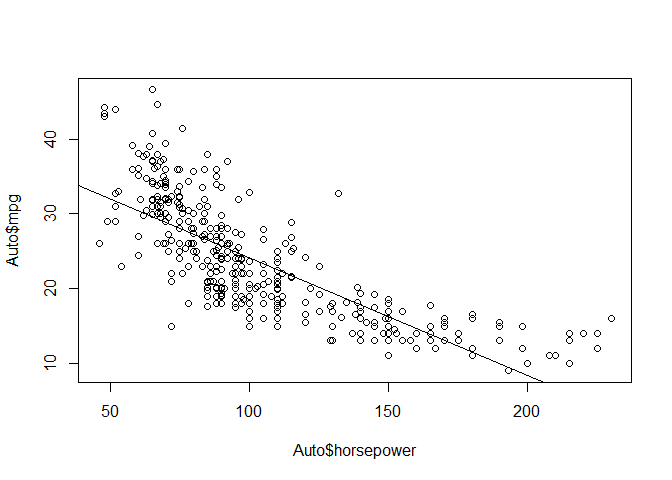
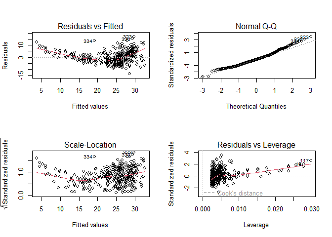
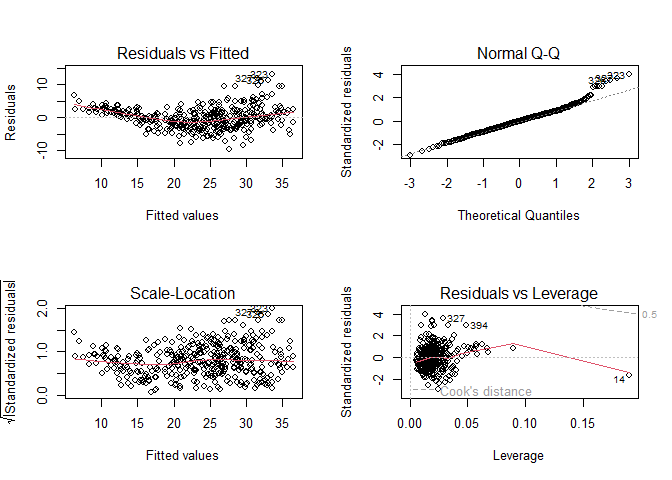
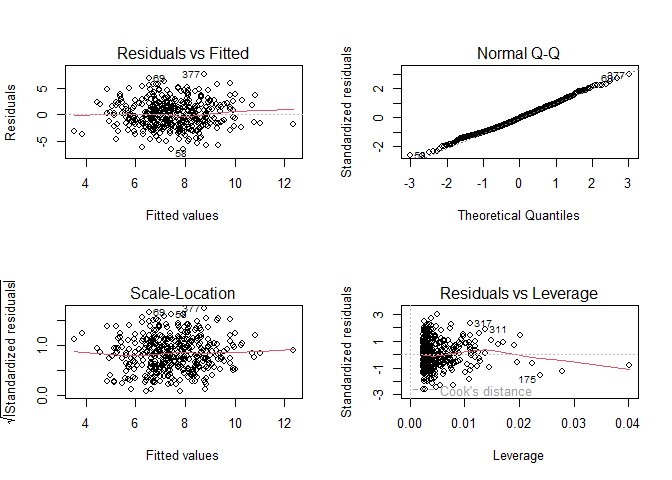

03-execises
================

- <a href="#conceptual" id="toc-conceptual"><span
  class="toc-section-number">1</span> Conceptual</a>
- <a href="#applied" id="toc-applied"><span
  class="toc-section-number">2</span> Applied</a>

## Conceptual

1.  ***Describe the null hypotheses to which the p-values given in Table
    3.4 correspond. Explain what conclusions you can draw based on these
    p-values. Your explanation should be phrased in terms of sales, TV,
    radio, and newspaper, rather than in terms of the coefficients of
    the linear model.***

Null hypotheses for each predictor each coefficient is 0. We can see in
the table that we can reject the null hypotheses for **TV** and
**radio** but there isn’t enough evidence to reject the null hypotheses
for **newspaper**.

2.  ***Carefully explain the differences between the KNN classifier and
    KNN regression methods.***

The classifier assigns classes based on the most often class of the
closest $K$ elements, on the other hand the regression estimate each
value taking the mean of the closest $K$ elements.

3.  ***Suppose we have a data set with five predictors to predict the
    starting salary after graduation (in thousands of dollars) and after
    using least squares we fitted the next model:***

| Variable                                    | Coefficient              |
|:--------------------------------------------|:-------------------------|
| Level (High School)                         | $\hat{\beta}_{0} = 50$   |
| $X_{1}$ = GPA                               | $\hat{\beta}_{1} = 20$   |
| $X_{2}$ = IQ                                | $\hat{\beta}_{2} = 0.07$ |
| $X_{3}$ = Level (College)                   | $\hat{\beta}_{3} = 35$   |
| $X_{4}$ = Interaction between GPA and IQ    | $\hat{\beta}_{4} = 0.01$ |
| $X_{5}$ = Interaction between GPA and Level | $\hat{\beta}_{5} = −10$  |

- **Which answer is correct, and why?**\*

Based on this information we can say that:

> For a fixed value of IQ and GPA, college graduates earn more, on
> average, than high school graduate.

As High School students earn on average $\hat{\beta}_{0} = 50$ College
students earn \|$\hat{\beta}_{0} + \hat{\beta}_{3} = 85$

- ***Predict the salary of a college graduate with IQ of 110 and a GPA
  of 4.0.***

$$
\begin{split}
\hat{Y} & = 35 + 20 (4) + 0.07 (110) + 35 + 0.01(4)(110) - 10 (4) \\
        & = 122.1
\end{split}
$$

- ***True or false: Since the coefficient for the GPA/IQ interaction
  term is very small, there is very little evidence of an interaction
  effect. Justify your answer.***

FALSE, we can not make conclusions about the significance of any tern
about checking the the standard error of each term. The coefficient
might small because the IQ has very high values if we contrast the GPA
ones.

4.  ***I collect a set of data (n = 100 observations) containing a
    single predictor and a quantitative response. I then fit a linear
    regression model to the data, as well as a separate cubic
    regression,
    i.e. $Y = \beta_{0} + \beta_{1}x + \beta_{2}x^2 + \beta_{3}x^3 + \epsilon$.***

- ***Suppose that the true relationship between X and Y is linear,
  i.e. $Y = \beta_{0} + \beta_{1}x + \epsilon$. Consider the training
  residual sum of squares (RSS) for the linear regression, and also the
  training RSS for the cubic regression. Would we expect one to be lower
  than the other, would we expect them to be the same, or is there not
  enough information to tell? Justify your answer.***

As the training RSS always gets lower as we increase the flexibility the
cubic regression would have a lower RSS.

- \***Answer (a) using test rather than training RSS.**

The linear regression would have a lower test RSS, as it reduces de
scare bias of the model.

- ***Suppose that the true relationship between X and Y is not linear,
  but we don’t know how far it is from linear. Consider the training RSS
  for the linear regression, and also the training RSS for the cubic
  regression. Would we expect one to be lower than the other, would we
  expect them to be the same, or is there not enough information to
  tell? Justify your answer.***

As the training RSS always gets lower as we increase the flexibility the
cubic regression would have a lower RSS.

- \***Answer (c) using test rather than training RSS.**

The cubic regression would have a lower test RSS, as it reduces de scare
bias of the model.

5.  ***Consider the fitted values that result from performing linear
    regression without an intercept. In this setting, the $i$th fitted
    value takes the form.***

$$
\hat{y}_{i} = x_{i}\hat{\beta}
$$

***Where***

$$
\hat{\beta}= \left( \sum_{i=1}^{n}{x_{i}y_{i}}  \right) /
             \left( \sum_{i'=1}^{n}{x_{i'}^2}  \right)
$$

- ***Show that we can write***

$$
\hat{y}_{i} = \sum_{i'=1}^{n}{a_{i'}y_{i'}}
$$ I am not sure about this execise as I don’t understand the difference
between $i$ and $i'$.

$$
\begin{split}
\sum_{i'=1}^{n}{a_{i'}y_{i'}} & = x_{i}\hat{\beta} \\
\sum_{i'=1}^{n}{a_{i'}y_{i'}} & = x_{i}\frac{\sum_{i=1}^{n}{x_{i}y_{i}}}
                                            {\sum_{i'=1}^{n}{x_{i'}^2} } \\
\sum_{i'=1}^{n}{a_{i'}} \sum_{i'=1}^{n}{y_{i'}} & = \frac{x_{i}\sum_{i=1}^{n}{x_{i}}}
                                                         {\sum_{i'=1}^{n}{x_{i'}^2} } 
                                                    \sum_{i=1}^{n} {y_{i}} \\
\sum_{i'=1}^{n}{a_{i'}} & = \frac{x_{i}\sum_{i=1}^{n}{x_{i}}}
                                                         {\sum_{i'=1}^{n}{x_{i'}^2} }
\end{split}
$$

6.  ***Using (3.4), argue that in the case of simple linear regression,
    the least squares line always passes through the point
    $(\overline{x},\overline{x})$.***

As you can see bellow the intercept it’s the responsible for that
property.

$$
\begin{split}
\hat{y} & = \left( \hat{\beta}_{0} \right) + \hat{\beta}_{1} \overline{x} \\
\hat{y} & = \overline{y} - \hat{\beta}_{1}\overline{x} + \hat{\beta}_{1} \overline{x} \\
\hat{y} & = \overline{y}
\end{split}
$$

## Applied

7.  **This question involves the use of simple linear regression on the
    Auto data set.**

- ***Use the lm() function to perform a simple linear regression with
  mpg as the response and horsepower as the predictor. Use the summary()
  function to print the results. Comment on the output.***

``` r
library(ISLR2)
```

    Warning: package 'ISLR2' was built under R version 4.2.2

``` r
AutoSimpleModel <- lm(mpg ~ horsepower, data = Auto)

summary(AutoSimpleModel)
```


    Call:
    lm(formula = mpg ~ horsepower, data = Auto)

    Residuals:
         Min       1Q   Median       3Q      Max 
    -13.5710  -3.2592  -0.3435   2.7630  16.9240 

    Coefficients:
                 Estimate Std. Error t value Pr(>|t|)    
    (Intercept) 39.935861   0.717499   55.66   <2e-16 ***
    horsepower  -0.157845   0.006446  -24.49   <2e-16 ***
    ---
    Signif. codes:  0 '***' 0.001 '**' 0.01 '*' 0.05 '.' 0.1 ' ' 1

    Residual standard error: 4.906 on 390 degrees of freedom
    Multiple R-squared:  0.6059,    Adjusted R-squared:  0.6049 
    F-statistic: 599.7 on 1 and 390 DF,  p-value: < 2.2e-16

As we see the regression p-value is much lower than 0.05 and we can
reject the null hypotheses to conclude that there is a **strong
relationship** between the response en the predictor. The coefficient of
horsepower is negative, so we know that as the predictor increase the
response decrease.

- ***What is the predicted mpg associated with a horsepower of 98? What
  are the associated 95 % confidence and prediction intervals.***

``` r
predict(AutoSimpleModel, newdata = data.frame(horsepower = 98), interval = "confidence")
```

           fit      lwr      upr
    1 24.46708 23.97308 24.96108

``` r
predict(AutoSimpleModel, newdata = data.frame(horsepower = 98), interval = "prediction")
```

           fit     lwr      upr
    1 24.46708 14.8094 34.12476

- ***Plot the response and the predictor. Use the abline() function to
  display the least squares regression line.***

``` r
plot(Auto$horsepower,Auto$mpg)
abline(AutoSimpleModel)
```



- ***Use the plot() function to produce diagnostic plots of the least
  squares regression fit. Comment on any problems you see with the
  fit.***

``` r
par(mfrow = c(2, 2))
plot(AutoSimpleModel)
```



The *Residuals vs Fitted* shows that the relation is not linear and
variance isn’t constant.

9.  ***This question involves the use of multiple linear regression on
    the Auto data set.***

- ***Produce a scatterplot matrix which includes all of the variables in
  the data set.***

``` r
pairs(Auto)
```


- ***Compute the matrix of correlations between the variables using the
  function cor(). You will need to exclude the name variable, which is
  qualitative.***

``` r
Auto |>
  subset(select = -name)|>
  cor()
```

                        mpg  cylinders displacement horsepower     weight
    mpg           1.0000000 -0.7776175   -0.8051269 -0.7784268 -0.8322442
    cylinders    -0.7776175  1.0000000    0.9508233  0.8429834  0.8975273
    displacement -0.8051269  0.9508233    1.0000000  0.8972570  0.9329944
    horsepower   -0.7784268  0.8429834    0.8972570  1.0000000  0.8645377
    weight       -0.8322442  0.8975273    0.9329944  0.8645377  1.0000000
    acceleration  0.4233285 -0.5046834   -0.5438005 -0.6891955 -0.4168392
    year          0.5805410 -0.3456474   -0.3698552 -0.4163615 -0.3091199
    origin        0.5652088 -0.5689316   -0.6145351 -0.4551715 -0.5850054
                 acceleration       year     origin
    mpg             0.4233285  0.5805410  0.5652088
    cylinders      -0.5046834 -0.3456474 -0.5689316
    displacement   -0.5438005 -0.3698552 -0.6145351
    horsepower     -0.6891955 -0.4163615 -0.4551715
    weight         -0.4168392 -0.3091199 -0.5850054
    acceleration    1.0000000  0.2903161  0.2127458
    year            0.2903161  1.0000000  0.1815277
    origin          0.2127458  0.1815277  1.0000000

- ***Use the lm() function to perform a multiple linear regression with
  mpg as the response and all other variables except name as the
  predictors. Use the summary() function to print the results. Comment
  on the output. For instance***

``` r
AutoModelNoInteraction <- 
  lm(mpg ~ . -name, data = Auto)

AutoModelNoInteractionummary <- 
  summary(AutoModelNoInteraction)

AutoModelNoInteractionummary
```


    Call:
    lm(formula = mpg ~ . - name, data = Auto)

    Residuals:
        Min      1Q  Median      3Q     Max 
    -9.5903 -2.1565 -0.1169  1.8690 13.0604 

    Coefficients:
                   Estimate Std. Error t value Pr(>|t|)    
    (Intercept)  -17.218435   4.644294  -3.707  0.00024 ***
    cylinders     -0.493376   0.323282  -1.526  0.12780    
    displacement   0.019896   0.007515   2.647  0.00844 ** 
    horsepower    -0.016951   0.013787  -1.230  0.21963    
    weight        -0.006474   0.000652  -9.929  < 2e-16 ***
    acceleration   0.080576   0.098845   0.815  0.41548    
    year           0.750773   0.050973  14.729  < 2e-16 ***
    origin         1.426141   0.278136   5.127 4.67e-07 ***
    ---
    Signif. codes:  0 '***' 0.001 '**' 0.01 '*' 0.05 '.' 0.1 ' ' 1

    Residual standard error: 3.328 on 384 degrees of freedom
    Multiple R-squared:  0.8215,    Adjusted R-squared:  0.8182 
    F-statistic: 252.4 on 7 and 384 DF,  p-value: < 2.2e-16

- ***Is there a relationship between the predictors and the response?***

As the regression p-value is bellow 0.05 we can reject the null
hypothesis and conclude that at least one of the predictors have a
relation with the response.

- ***Which predictors appear to have a statistically significant
  relationship to the response?***

``` r
AutoModelNoInteractionummary |>
  coefficients() |>
  as.data.frame() |>
  subset(`Pr(>|t|)` < 0.05)
```

                      Estimate   Std. Error   t value     Pr(>|t|)
    (Intercept)  -17.218434622 4.6442941494 -3.707438 2.401841e-04
    displacement   0.019895644 0.0075150792  2.647430 8.444649e-03
    weight        -0.006474043 0.0006520478 -9.928787 7.874953e-21
    year           0.750772678 0.0509731223 14.728795 3.055983e-39
    origin         1.426140495 0.2781360924  5.127492 4.665681e-07

- ***What does the coefficient for the year variable suggest?***

It suggests that cars in average cars can drive 0.75 more miles per
gallon every year.

- ***Use the plot() function to produce diagnostic plots of the linear
  regression fit. Comment on any problems you see with the fit. Do the
  residual plots suggest any unusually large outliers? Does the leverage
  plot identify any observations with unusually high leverage?***

  - Non-linearity of the response-predictor relationships
  - Non-constant variance
  - High-leverage points

``` r
par(mfrow = c(2, 2))
plot(AutoModelNoInteraction)
```



- ***Use the \* and : symbols to fit linear regression models with
  interaction effects. Do any interactions appear to be statistically
  significant?***

``` r
remove_rownames <- function(DF){
  
  DF <- cbind(name = row.names(DF), DF)
  rownames(DF) <- NULL
  return(DF)
  
}


names(Auto) |>
  setdiff(c("mpg","name")) |>
  (\(x) c(x,
          combn(x, m = 2, 
                FUN = \(y) paste0(y,collapse =":"))))() |>
  paste0(collapse = " + ") |>
  paste0("mpg ~ ", predictors = _) |>
  lm(data = Auto) |>
  summary() |>
  coef() |>
  as.data.frame() |>
  remove_rownames() |>
  subset(`Pr(>|t|)` < 0.05 | name == "year")
```

                      name      Estimate  Std. Error   t value    Pr(>|t|)
    3         displacement  -0.478538689 0.189353429 -2.527225 0.011920695
    6         acceleration  -5.859173212 2.173621188 -2.695582 0.007353578
    7                 year   0.697430284 0.609670317  1.143947 0.253399572
    8               origin -20.895570401 7.097090511 -2.944245 0.003445892
    18   displacement:year   0.005933802 0.002390716  2.482019 0.013515633
    27   acceleration:year   0.055621508 0.025581747  2.174265 0.030330641
    28 acceleration:origin   0.458316099 0.156659694  2.925552 0.003654670

- ***Try a few different transformations of the variables, such as
  $\log{x}$, $\sqrt{x}$, $x^2$. Comment on your findings.***

As we can see bellow we can explain 3% more of the variability by
applying log to some variables.

``` r
library(data.table)

apply_fun_lm <- function(FUN,DF, trans_vars, remove_vars){
  
    as.data.table(DF
    )[, (trans_vars) := lapply(.SD, FUN), .SDcols = trans_vars
    ][, !remove_vars, with = FALSE
    ][, lm(mpg ~ . , data = .SD)] |>
    summary() |>
    (\(x) data.table(adj.r.squared = x$adj.r.squared,
                     sigma = x$sigma,
                     p.value = pf(x$fstatistic["value"], 
                                  x$fstatistic["numdf"], 
                                  x$fstatistic["dendf"], 
                                  lower.tail = FALSE)))()
  
}


data.table(function_name = c("original","log", "sqrt","x^2"),
           function_list = list(\(x) x,log, sqrt, \(x) x^2)
)[, data :=  
    lapply(function_list, 
           FUN = apply_fun_lm,
           DF = Auto, 
           trans_vars = c("displacement", "horsepower", 
                          "weight", "acceleration"),
           remove_vars = "name")
][, rbindlist(data) |> cbind(function_name, end = _)]
```

       function_name end.adj.r.squared end.sigma   end.p.value
              <char>             <num>     <num>         <num>
    1:      original         0.8182238  3.327682 2.037106e-139
    2:           log         0.8474528  3.048425 5.352738e-154
    3:          sqrt         0.8312704  3.206041 1.304165e-145
    4:           x^2         0.7986663  3.502124 6.372862e-131

10. ***This question should be answered using the Carseats data set.***

- ***Fit a multiple regression model to predict Sales using Price,
  Urban, and US.***

``` r
CarseatsModel <-
  lm(Sales~Price+Urban+US, data = Carseats)

CarseatsModelSummary <-  
  summary(CarseatsModel)

CarseatsModelSummary
```


    Call:
    lm(formula = Sales ~ Price + Urban + US, data = Carseats)

    Residuals:
        Min      1Q  Median      3Q     Max 
    -6.9206 -1.6220 -0.0564  1.5786  7.0581 

    Coefficients:
                 Estimate Std. Error t value Pr(>|t|)    
    (Intercept) 13.043469   0.651012  20.036  < 2e-16 ***
    Price       -0.054459   0.005242 -10.389  < 2e-16 ***
    UrbanYes    -0.021916   0.271650  -0.081    0.936    
    USYes        1.200573   0.259042   4.635 4.86e-06 ***
    ---
    Signif. codes:  0 '***' 0.001 '**' 0.01 '*' 0.05 '.' 0.1 ' ' 1

    Residual standard error: 2.472 on 396 degrees of freedom
    Multiple R-squared:  0.2393,    Adjusted R-squared:  0.2335 
    F-statistic: 41.52 on 3 and 396 DF,  p-value: < 2.2e-16

- ***Provide an interpretation of each coefficient in the model. Be
  careful—some of the variables in the model are qualitative!***

``` r
CarseatsInterationModel <-
  lm(Sales~Price*Urban*US, data = Carseats)

CarseatsInterationModelSummary <-  
  summary(CarseatsInterationModel)

CarseatsInterationModelSummary
```


    Call:
    lm(formula = Sales ~ Price * Urban * US, data = Carseats)

    Residuals:
        Min      1Q  Median      3Q     Max 
    -6.7952 -1.6659 -0.0984  1.6119  7.2433 

    Coefficients:
                          Estimate Std. Error t value Pr(>|t|)    
    (Intercept)          13.456350   1.727210   7.791 6.03e-14 ***
    Price                -0.061657   0.014875  -4.145 4.17e-05 ***
    UrbanYes             -0.651545   2.071401  -0.315    0.753    
    USYes                 2.049051   2.322591   0.882    0.378    
    Price:UrbanYes        0.010793   0.017796   0.606    0.545    
    Price:USYes          -0.001567   0.019972  -0.078    0.937    
    UrbanYes:USYes       -1.122034   2.759662  -0.407    0.685    
    Price:UrbanYes:USYes  0.001288   0.023619   0.055    0.957    
    ---
    Signif. codes:  0 '***' 0.001 '**' 0.01 '*' 0.05 '.' 0.1 ' ' 1

    Residual standard error: 2.473 on 392 degrees of freedom
    Multiple R-squared:  0.2467,    Adjusted R-squared:  0.2333 
    F-statistic: 18.34 on 7 and 392 DF,  p-value: < 2.2e-16

- ***Write out the model in equation form, being careful to handle the
  qualitative variables properly.***

``` r
coef(CarseatsInterationModel) |>
  round(3) |>
  (\(x) paste0(ifelse(x < 0, " - "," + "), abs(x)," \text{ ", names(x),"}"))() |>
  sub(pattern = " \text{ (Intercept)}",replacement = "", fixed = TRUE) |>
  paste0(collapse = "") |>
  sub(pattern = "^ \\+ ", replacement = "") |>
  sub(pattern = "^ - ", replacement = "") |>
  paste0("hat{Y} = ", FUN = _)
```

    [1] "hat{Y} = 13.456 - 0.062 \text{ Price} - 0.652 \text{ UrbanYes} + 2.049 \text{ USYes} + 0.011 \text{ Price:UrbanYes} - 0.002 \text{ Price:USYes} - 1.122 \text{ UrbanYes:USYes} + 0.001 \text{ Price:UrbanYes:USYes}"

$$
\begin{split}
\hat{Sales} & = 13.456 - 0.062 \text{ Price} - 0.652 \text{ UrbanYes} \\
            & \quad + 2.049 \text{ USYes} + 0.011 \text{ Price:UrbanYes} \\
            & \quad - 0.002 \text{ Price:USYes} - 1.122 \text{ UrbanYes:USYes} \\
            & \quad + 0.001 \text{ Price:UrbanYes:USYes}
\end{split}
$$

- ***For which of the predictors can you reject the null hypothesis H0 :
  βj = 0?***

``` r
coef(CarseatsInterationModelSummary) |>
  as.data.frame() |>
  (\(DF) DF[DF$`Pr(>|t|)` < 0.05,])()
```

                   Estimate Std. Error   t value     Pr(>|t|)
    (Intercept) 13.45634952 1.72720976  7.790802 6.030364e-14
    Price       -0.06165717 0.01487479 -4.145079 4.165536e-05

- ***On the basis of your response to the previous question, fit a
  smaller model that only uses the predictors for which there is
  evidence of association with the outcome.***

``` r
CarseatsPriceModel <-
  lm(Sales~Price, data = Carseats)

CarseatsPriceModelSummary <-
  summary(CarseatsPriceModel)

CarseatsPriceModelSummary
```


    Call:
    lm(formula = Sales ~ Price, data = Carseats)

    Residuals:
        Min      1Q  Median      3Q     Max 
    -6.5224 -1.8442 -0.1459  1.6503  7.5108 

    Coefficients:
                 Estimate Std. Error t value Pr(>|t|)    
    (Intercept) 13.641915   0.632812  21.558   <2e-16 ***
    Price       -0.053073   0.005354  -9.912   <2e-16 ***
    ---
    Signif. codes:  0 '***' 0.001 '**' 0.01 '*' 0.05 '.' 0.1 ' ' 1

    Residual standard error: 2.532 on 398 degrees of freedom
    Multiple R-squared:  0.198, Adjusted R-squared:  0.196 
    F-statistic: 98.25 on 1 and 398 DF,  p-value: < 2.2e-16

- ***How well do the models in (a) and (e) fit the data?***

**Model a** fits better to the data with 0.23 against 0.2 of **model
e**.

- ***Using the model from (e), obtain 95 % confidence intervals for the
  coefficient(s).***

``` r
confint(CarseatsPriceModel, level = 0.95)
```

                     2.5 %      97.5 %
    (Intercept) 12.3978438 14.88598655
    Price       -0.0635995 -0.04254653

- ***Is there evidence of outliers or high leverage observations in the
  model from (e)?***

``` r
par(mfrow = c(2,2))
plot(CarseatsPriceModel)
```



``` r
par(mfrow = c(1,1))
```

There is a leverage point.

11. ***In this problem we will investigate the t-statistic for the null
    hypothesis H0 : β = 0 in simple linear regression without an
    intercept. To begin, we generate a predictor x and a response y as
    follows.***

``` r
set.seed(1)
x<-rnorm(100)
y<-2*x+rnorm(100)
```
