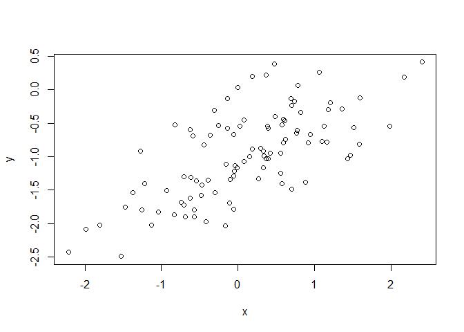
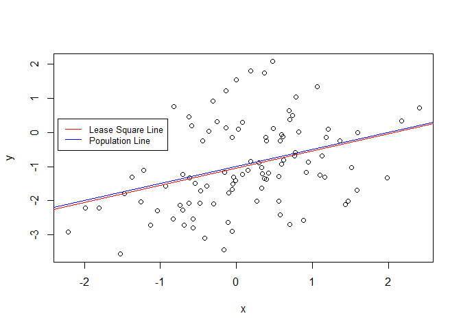
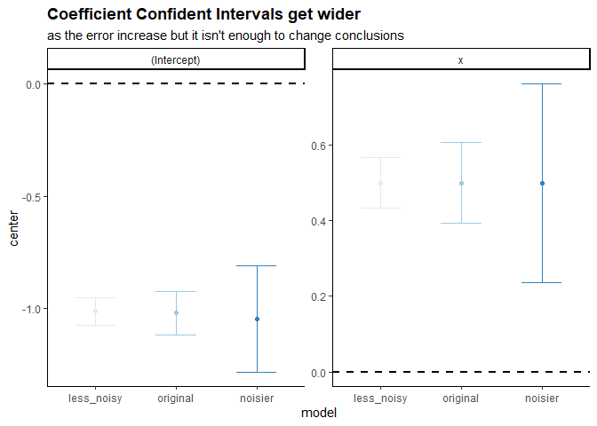

03-execises
================

- <a href="#conceptual" id="toc-conceptual"><span
  class="toc-section-number">1</span> Conceptual</a>
- <a href="#applied" id="toc-applied"><span
  class="toc-section-number">2</span> Applied</a>

## Conceptual

1.  **Describe the null hypotheses to which the p-values given in Table
    3.4 correspond. Explain what conclusions you can draw based on these
    p-values. Your explanation should be phrased in terms of sales, TV,
    radio, and newspaper, rather than in terms of the coefficients of
    the linear model.**

Null hypotheses for each predictor each coefficient is 0. We can see in
the table that we can reject the null hypotheses for **TV** and
**radio** but there isn’t enough evidence to reject the null hypotheses
for **newspaper**.

2.  **Carefully explain the differences between the KNN classifier and
    KNN regression methods.**

The classifier assigns classes based on the most often class of the
closest $K$ elements, on the other hand the regression estimate each
value taking the mean of the closest $K$ elements.

3.  **Suppose we have a data set with five predictors to predict the
    starting salary after graduation (in thousands of dollars) and after
    using least squares we fitted the next model:**

| Variable                                    | Coefficient              |
|:--------------------------------------------|:-------------------------|
| Level (High School)                         | $\hat{\beta}_{0} = 50$   |
| $X_{1}$ = GPA                               | $\hat{\beta}_{1} = 20$   |
| $X_{2}$ = IQ                                | $\hat{\beta}_{2} = 0.07$ |
| $X_{3}$ = Level (College)                   | $\hat{\beta}_{3} = 35$   |
| $X_{4}$ = Interaction between GPA and IQ    | $\hat{\beta}_{4} = 0.01$ |
| $X_{5}$ = Interaction between GPA and Level | $\hat{\beta}_{5} = −10$  |

- **Which answer is correct, and why?**

Based on this information we can say that:

> For a fixed value of IQ and GPA, college graduates earn more, on
> average, than high school graduate.

As High School students earn on average $\hat{\beta}_{0} = 50$ College
students earn \|$\hat{\beta}_{0} + \hat{\beta}_{3} = 85$

- **Predict the salary of a college graduate with IQ of 110 and a GPA of
  4.0.**

$$
\begin{split}
\hat{Y} & = 35 + 20 (4) + 0.07 (110) + 35 + 0.01(4)(110) - 10 (4) \\
        & = 122.1
\end{split}
$$

- **True or false: Since the coefficient for the GPA/IQ interaction term
  is very small, there is very little evidence of an interaction effect.
  Justify your answer.**

FALSE, we can not make conclusions about the significance of any tern
about checking the the standard error of each term. The coefficient
might small because the IQ has very high values if we contrast the GPA
ones.

4.  **I collect a set of data (n = 100 observations) containing a single
    predictor and a quantitative response. I then fit a linear
    regression model to the data, as well as a separate cubic
    regression,
    i.e. $Y = \beta_{0} + \beta_{1}x + \beta_{2}x^2 + \beta_{3}x^3 + \epsilon$.**

- **Suppose that the true relationship between X and Y is linear,
  i.e. $Y = \beta_{0} + \beta_{1}x + \epsilon$. Consider the training
  residual sum of squares (RSS) for the linear regression, and also the
  training RSS for the cubic regression. Would we expect one to be lower
  than the other, would we expect them to be the same, or is there not
  enough information to tell? Justify your answer.**

As the training RSS always gets lower as we increase the flexibility the
cubic regression would have a lower RSS.

- **Answer (a) using test rather than training RSS.**

The linear regression would have a lower test RSS, as it reduces de
scare bias of the model.

- **Suppose that the true relationship between X and Y is not linear,
  but we don’t know how far it is from linear. Consider the training RSS
  for the linear regression, and also the training RSS for the cubic
  regression. Would we expect one to be lower than the other, would we
  expect them to be the same, or is there not enough information to
  tell? Justify your answer.**

As the training RSS always gets lower as we increase the flexibility the
cubic regression would have a lower RSS.

- **Answer (c) using test rather than training RSS.**

The cubic regression would have a lower test RSS, as it reduces de scare
bias of the model.

5.  **Consider the fitted values that result from performing linear
    regression without an intercept. In this setting, the $i$th fitted
    value takes the form.**

$$
\hat{y}_{i} = x_{i}\hat{\beta}
$$

**Where**

$$
\hat{\beta}= \left( \sum_{i=1}^{n}{x_{i}y_{i}}  \right) /
             \left( \sum_{i'=1}^{n}{x_{i'}^2}  \right)
$$

- **Show that we can write**

$$
\hat{y}_{i} = \sum_{i'=1}^{n}{a_{i'}y_{i'}}
$$ I am not sure about this execise as I don’t understand the difference
between $i$ and $i'$.

$$
\begin{split}
\sum_{i'=1}^{n}{a_{i'}y_{i'}} & = x_{i}\hat{\beta} \\
\sum_{i'=1}^{n}{a_{i'}y_{i'}} & = x_{i}\frac{\sum_{i=1}^{n}{x_{i}y_{i}}}
                                            {\sum_{i'=1}^{n}{x_{i'}^2} } \\
\sum_{i'=1}^{n}{a_{i'}} \sum_{i'=1}^{n}{y_{i'}} & = \frac{x_{i}\sum_{i=1}^{n}{x_{i}}}
                                                         {\sum_{i'=1}^{n}{x_{i'}^2} } 
                                                    \sum_{i=1}^{n} {y_{i}} \\
\sum_{i'=1}^{n}{a_{i'}} & = \frac{x_{i}\sum_{i=1}^{n}{x_{i}}}
                                                         {\sum_{i'=1}^{n}{x_{i'}^2} }
\end{split}
$$

6.  **Using (3.4), argue that in the case of simple linear regression,
    the least squares line always passes through the point
    $(\overline{x},\overline{x})$.**

As you can see bellow the intercept it’s the responsible for that
property.

$$
\begin{split}
\hat{y} & = \left( \hat{\beta}_{0} \right) + \hat{\beta}_{1} \overline{x} \\
\hat{y} & = \overline{y} - \hat{\beta}_{1}\overline{x} + \hat{\beta}_{1} \overline{x} \\
\hat{y} & = \overline{y}
\end{split}
$$

## Applied

7.  **This question involves the use of simple linear regression on the
    Auto data set.**

- **Use the lm() function to perform a simple linear regression with mpg
  as the response and horsepower as the predictor. Use the summary()
  function to print the results. Comment on the output.**

``` r
library(ISLR2)
```

    Warning: package 'ISLR2' was built under R version 4.2.2

``` r
AutoSimpleModel <- lm(mpg ~ horsepower, data = Auto)

summary(AutoSimpleModel)
```


    Call:
    lm(formula = mpg ~ horsepower, data = Auto)

    Residuals:
         Min       1Q   Median       3Q      Max 
    -13.5710  -3.2592  -0.3435   2.7630  16.9240 

    Coefficients:
                 Estimate Std. Error t value Pr(>|t|)    
    (Intercept) 39.935861   0.717499   55.66   <2e-16 ***
    horsepower  -0.157845   0.006446  -24.49   <2e-16 ***
    ---
    Signif. codes:  0 '***' 0.001 '**' 0.01 '*' 0.05 '.' 0.1 ' ' 1

    Residual standard error: 4.906 on 390 degrees of freedom
    Multiple R-squared:  0.6059,    Adjusted R-squared:  0.6049 
    F-statistic: 599.7 on 1 and 390 DF,  p-value: < 2.2e-16

As we see the regression p-value is much lower than 0.05 and we can
reject the null hypotheses to conclude that there is a **strong
relationship** between the response en the predictor. The coefficient of
horsepower is negative, so we know that as the predictor increase the
response decrease.

- **What is the predicted mpg associated with a horsepower of 98? What
  are the associated 95 % confidence and prediction intervals.**

``` r
predict(AutoSimpleModel, newdata = data.frame(horsepower = 98), interval = "confidence")
```

           fit      lwr      upr
    1 24.46708 23.97308 24.96108

``` r
predict(AutoSimpleModel, newdata = data.frame(horsepower = 98), interval = "prediction")
```

           fit     lwr      upr
    1 24.46708 14.8094 34.12476

- **Plot the response and the predictor. Use the abline() function to
  display the least squares regression line.**

``` r
plot(Auto$horsepower,Auto$mpg)
abline(AutoSimpleModel)
```


- **Use the plot() function to produce diagnostic plots of the least
  squares regression fit. Comment on any problems you see with the
  fit.**

``` r
par(mfrow = c(2, 2))
plot(AutoSimpleModel)
```


The *Residuals vs Fitted* shows that the relation is not linear and
variance isn’t constant.

9.  **This question involves the use of multiple linear regression on
    the Auto data set.**

- **Produce a scatterplot matrix which includes all of the variables in
  the data set.**

``` r
pairs(Auto)
```


- **Compute the matrix of correlations between the variables using the
  function cor(). You will need to exclude the name variable, which is
  qualitative.**

``` r
Auto |>
  subset(select = -name)|>
  cor()
```

                        mpg  cylinders displacement horsepower     weight
    mpg           1.0000000 -0.7776175   -0.8051269 -0.7784268 -0.8322442
    cylinders    -0.7776175  1.0000000    0.9508233  0.8429834  0.8975273
    displacement -0.8051269  0.9508233    1.0000000  0.8972570  0.9329944
    horsepower   -0.7784268  0.8429834    0.8972570  1.0000000  0.8645377
    weight       -0.8322442  0.8975273    0.9329944  0.8645377  1.0000000
    acceleration  0.4233285 -0.5046834   -0.5438005 -0.6891955 -0.4168392
    year          0.5805410 -0.3456474   -0.3698552 -0.4163615 -0.3091199
    origin        0.5652088 -0.5689316   -0.6145351 -0.4551715 -0.5850054
                 acceleration       year     origin
    mpg             0.4233285  0.5805410  0.5652088
    cylinders      -0.5046834 -0.3456474 -0.5689316
    displacement   -0.5438005 -0.3698552 -0.6145351
    horsepower     -0.6891955 -0.4163615 -0.4551715
    weight         -0.4168392 -0.3091199 -0.5850054
    acceleration    1.0000000  0.2903161  0.2127458
    year            0.2903161  1.0000000  0.1815277
    origin          0.2127458  0.1815277  1.0000000

- **Use the lm() function to perform a multiple linear regression with
  mpg as the response and all other variables except name as the
  predictors. Use the summary() function to print the results. Comment
  on the output. For instance**

``` r
AutoModelNoInteraction <- 
  lm(mpg ~ . -name, data = Auto)

AutoModelNoInteractionummary <- 
  summary(AutoModelNoInteraction)

AutoModelNoInteractionummary
```


    Call:
    lm(formula = mpg ~ . - name, data = Auto)

    Residuals:
        Min      1Q  Median      3Q     Max 
    -9.5903 -2.1565 -0.1169  1.8690 13.0604 

    Coefficients:
                   Estimate Std. Error t value Pr(>|t|)    
    (Intercept)  -17.218435   4.644294  -3.707  0.00024 ***
    cylinders     -0.493376   0.323282  -1.526  0.12780    
    displacement   0.019896   0.007515   2.647  0.00844 ** 
    horsepower    -0.016951   0.013787  -1.230  0.21963    
    weight        -0.006474   0.000652  -9.929  < 2e-16 ***
    acceleration   0.080576   0.098845   0.815  0.41548    
    year           0.750773   0.050973  14.729  < 2e-16 ***
    origin         1.426141   0.278136   5.127 4.67e-07 ***
    ---
    Signif. codes:  0 '***' 0.001 '**' 0.01 '*' 0.05 '.' 0.1 ' ' 1

    Residual standard error: 3.328 on 384 degrees of freedom
    Multiple R-squared:  0.8215,    Adjusted R-squared:  0.8182 
    F-statistic: 252.4 on 7 and 384 DF,  p-value: < 2.2e-16

- **Is there a relationship between the predictors and the response?**

As the regression p-value is bellow 0.05 we can reject the null
hypothesis and conclude that at least one of the predictors have a
relation with the response.

- **Which predictors appear to have a statistically significant
  relationship to the response?**

``` r
AutoModelNoInteractionummary |>
  coefficients() |>
  as.data.frame() |>
  subset(`Pr(>|t|)` < 0.05)
```

                      Estimate   Std. Error   t value     Pr(>|t|)
    (Intercept)  -17.218434622 4.6442941494 -3.707438 2.401841e-04
    displacement   0.019895644 0.0075150792  2.647430 8.444649e-03
    weight        -0.006474043 0.0006520478 -9.928787 7.874953e-21
    year           0.750772678 0.0509731223 14.728795 3.055983e-39
    origin         1.426140495 0.2781360924  5.127492 4.665681e-07

- **What does the coefficient for the year variable suggest?**

It suggests that cars in average cars can drive 0.75 more miles per
gallon every year.

- **Use the plot() function to produce diagnostic plots of the linear
  regression fit. Comment on any problems you see with the fit. Do the
  residual plots suggest any unusually large outliers? Does the leverage
  plot identify any observations with unusually high leverage?**

  - Non-linearity of the response-predictor relationships
  - Non-constant variance
  - High-leverage points

``` r
par(mfrow = c(2, 2))
plot(AutoModelNoInteraction)
```


- ***Use the \* and : symbols to fit linear regression models with
  interaction effects. Do any interactions appear to be statistically
  significant?***

``` r
remove_rownames <- function(DF){
  
  DF <- cbind(name = row.names(DF), DF)
  rownames(DF) <- NULL
  return(DF)
  
}


names(Auto) |>
  setdiff(c("mpg","name")) |>
  (\(x) c(x,
          combn(x, m = 2, 
                FUN = \(y) paste0(y,collapse =":"))))() |>
  paste0(collapse = " + ") |>
  paste0("mpg ~ ", predictors = _) |>
  lm(data = Auto) |>
  summary() |>
  coef() |>
  as.data.frame() |>
  remove_rownames() |>
  subset(`Pr(>|t|)` < 0.05 | name == "year")
```

                      name      Estimate  Std. Error   t value    Pr(>|t|)
    3         displacement  -0.478538689 0.189353429 -2.527225 0.011920695
    6         acceleration  -5.859173212 2.173621188 -2.695582 0.007353578
    7                 year   0.697430284 0.609670317  1.143947 0.253399572
    8               origin -20.895570401 7.097090511 -2.944245 0.003445892
    18   displacement:year   0.005933802 0.002390716  2.482019 0.013515633
    27   acceleration:year   0.055621508 0.025581747  2.174265 0.030330641
    28 acceleration:origin   0.458316099 0.156659694  2.925552 0.003654670

- **Try a few different transformations of the variables, such as
  $\log{x}$, $\sqrt{x}$, $x^2$. Comment on your findings.**

As we can see bellow we can explain 3% more of the variability by
applying log to some variables.

``` r
library(data.table)

apply_fun_lm <- function(FUN,DF, trans_vars, remove_vars){
  
    as.data.table(DF
    )[, (trans_vars) := lapply(.SD, FUN), .SDcols = trans_vars
    ][, !remove_vars, with = FALSE
    ][, lm(mpg ~ . , data = .SD)] |>
    summary() |>
    (\(x) data.table(adj.r.squared = x$adj.r.squared,
                     sigma = x$sigma,
                     p.value = pf(x$fstatistic["value"], 
                                  x$fstatistic["numdf"], 
                                  x$fstatistic["dendf"], 
                                  lower.tail = FALSE)))()
  
}


data.table(function_name = c("original","log", "sqrt","x^2"),
           function_list = list(\(x) x,log, sqrt, \(x) x^2)
)[, data :=  
    lapply(function_list, 
           FUN = apply_fun_lm,
           DF = Auto, 
           trans_vars = c("displacement", "horsepower", 
                          "weight", "acceleration"),
           remove_vars = "name")
][, rbindlist(data) |> cbind(function_name, end = _)]
```

       function_name end.adj.r.squared end.sigma   end.p.value
              <char>             <num>     <num>         <num>
    1:      original         0.8182238  3.327682 2.037106e-139
    2:           log         0.8474528  3.048425 5.352738e-154
    3:          sqrt         0.8312704  3.206041 1.304165e-145
    4:           x^2         0.7986663  3.502124 6.372862e-131

10. **This question should be answered using the Carseats data set.**

- **Fit a multiple regression model to predict Sales using Price, Urban,
  and US.**

``` r
CarseatsModel <-
  lm(Sales~Price+Urban+US, data = Carseats)

CarseatsModelSummary <-  
  summary(CarseatsModel)

CarseatsModelSummary
```


    Call:
    lm(formula = Sales ~ Price + Urban + US, data = Carseats)

    Residuals:
        Min      1Q  Median      3Q     Max 
    -6.9206 -1.6220 -0.0564  1.5786  7.0581 

    Coefficients:
                 Estimate Std. Error t value Pr(>|t|)    
    (Intercept) 13.043469   0.651012  20.036  < 2e-16 ***
    Price       -0.054459   0.005242 -10.389  < 2e-16 ***
    UrbanYes    -0.021916   0.271650  -0.081    0.936    
    USYes        1.200573   0.259042   4.635 4.86e-06 ***
    ---
    Signif. codes:  0 '***' 0.001 '**' 0.01 '*' 0.05 '.' 0.1 ' ' 1

    Residual standard error: 2.472 on 396 degrees of freedom
    Multiple R-squared:  0.2393,    Adjusted R-squared:  0.2335 
    F-statistic: 41.52 on 3 and 396 DF,  p-value: < 2.2e-16

- **Provide an interpretation of each coefficient in the model. Be
  careful—some of the variables in the model are qualitative!**

``` r
CarseatsInterationModel <-
  lm(Sales~Price*Urban*US, data = Carseats)

CarseatsInterationModelSummary <-  
  summary(CarseatsInterationModel)

CarseatsInterationModelSummary
```


    Call:
    lm(formula = Sales ~ Price * Urban * US, data = Carseats)

    Residuals:
        Min      1Q  Median      3Q     Max 
    -6.7952 -1.6659 -0.0984  1.6119  7.2433 

    Coefficients:
                          Estimate Std. Error t value Pr(>|t|)    
    (Intercept)          13.456350   1.727210   7.791 6.03e-14 ***
    Price                -0.061657   0.014875  -4.145 4.17e-05 ***
    UrbanYes             -0.651545   2.071401  -0.315    0.753    
    USYes                 2.049051   2.322591   0.882    0.378    
    Price:UrbanYes        0.010793   0.017796   0.606    0.545    
    Price:USYes          -0.001567   0.019972  -0.078    0.937    
    UrbanYes:USYes       -1.122034   2.759662  -0.407    0.685    
    Price:UrbanYes:USYes  0.001288   0.023619   0.055    0.957    
    ---
    Signif. codes:  0 '***' 0.001 '**' 0.01 '*' 0.05 '.' 0.1 ' ' 1

    Residual standard error: 2.473 on 392 degrees of freedom
    Multiple R-squared:  0.2467,    Adjusted R-squared:  0.2333 
    F-statistic: 18.34 on 7 and 392 DF,  p-value: < 2.2e-16

- **Write out the model in equation form, being careful to handle the
  qualitative variables properly.**

``` r
coef(CarseatsInterationModel) |>
  round(3) |>
  (\(x) paste0(ifelse(x < 0, " - "," + "), abs(x)," \text{ ", names(x),"}"))() |>
  sub(pattern = " \text{ (Intercept)}",replacement = "", fixed = TRUE) |>
  paste0(collapse = "") |>
  sub(pattern = "^ \\+ ", replacement = "") |>
  sub(pattern = "^ - ", replacement = "") |>
  paste0("hat{Y} = ", FUN = _)
```

    [1] "hat{Y} = 13.456 - 0.062 \text{ Price} - 0.652 \text{ UrbanYes} + 2.049 \text{ USYes} + 0.011 \text{ Price:UrbanYes} - 0.002 \text{ Price:USYes} - 1.122 \text{ UrbanYes:USYes} + 0.001 \text{ Price:UrbanYes:USYes}"

$$
\begin{split}
\hat{Sales} & = 13.456 - 0.062 \text{ Price} - 0.652 \text{ UrbanYes} \\
            & \quad + 2.049 \text{ USYes} + 0.011 \text{ Price:UrbanYes} \\
            & \quad - 0.002 \text{ Price:USYes} - 1.122 \text{ UrbanYes:USYes} \\
            & \quad + 0.001 \text{ Price:UrbanYes:USYes}
\end{split}
$$

- **For which of the predictors can you reject the null hypothesis H0 :
  βj = 0?**

``` r
coef(CarseatsInterationModelSummary) |>
  as.data.frame() |>
  (\(DF) DF[DF$`Pr(>|t|)` < 0.05,])()
```

                   Estimate Std. Error   t value     Pr(>|t|)
    (Intercept) 13.45634952 1.72720976  7.790802 6.030364e-14
    Price       -0.06165717 0.01487479 -4.145079 4.165536e-05

- **On the basis of your response to the previous question, fit a smaller
  model that only uses the predictors for which there is evidence of
  association with the outcome.**

``` r
CarseatsPriceModel <-
  lm(Sales~Price, data = Carseats)

CarseatsPriceModelSummary <-
  summary(CarseatsPriceModel)

CarseatsPriceModelSummary
```


    Call:
    lm(formula = Sales ~ Price, data = Carseats)

    Residuals:
        Min      1Q  Median      3Q     Max 
    -6.5224 -1.8442 -0.1459  1.6503  7.5108 

    Coefficients:
                 Estimate Std. Error t value Pr(>|t|)    
    (Intercept) 13.641915   0.632812  21.558   <2e-16 ***
    Price       -0.053073   0.005354  -9.912   <2e-16 ***
    ---
    Signif. codes:  0 '***' 0.001 '**' 0.01 '*' 0.05 '.' 0.1 ' ' 1

    Residual standard error: 2.532 on 398 degrees of freedom
    Multiple R-squared:  0.198, Adjusted R-squared:  0.196 
    F-statistic: 98.25 on 1 and 398 DF,  p-value: < 2.2e-16

- **How well do the models in (a) and (e) fit the data?**

**Model a** fits better to the data with 0.23 against 0.2 of **model
e**.

- **Using the model from (e), obtain 95 % confidence intervals for the
  coefficient(s).**

``` r
confint(CarseatsPriceModel, level = 0.95)
```

                     2.5 %      97.5 %
    (Intercept) 12.3978438 14.88598655
    Price       -0.0635995 -0.04254653

- **Is there evidence of outliers or high leverage observations in the
  model from (e)?**

``` r
par(mfrow = c(2,2))
plot(CarseatsPriceModel)
```


``` r
par(mfrow = c(1,1))
```

There is a leverage point.

11. **In this problem we will investigate the t-statistic for the null
    hypothesis H0 : β = 0 in simple linear regression without an
    intercept. To begin, we generate a predictor x and a response y as
    follows.**

``` r
set.seed(1)

x <- rnorm(100)
y <- 2*x+rnorm(100)

SimulatedData <- data.frame(x, y) 
```

- **Perform a simple linear regression of y onto x, without an
  intercept. Report the coefficient estimate ˆβ, the standard error of
  this coefficient estimate, and the t-statistic and p-value associated
  with the null hypothesis H0 : β = 0. Comment on these results. (You
  can perform regression without an intercept using the command
  lm(y∼x+0).)**

As we can see below we can reject the null hypothesis and conclude that
**y** increases **1.99** for each unit of **x** explaining 78% of the
variability.

``` r
lm(y~ x+0, data = SimulatedData) |>
  summary()
```


    Call:
    lm(formula = y ~ x + 0, data = SimulatedData)

    Residuals:
        Min      1Q  Median      3Q     Max 
    -1.9154 -0.6472 -0.1771  0.5056  2.3109 

    Coefficients:
      Estimate Std. Error t value Pr(>|t|)    
    x   1.9939     0.1065   18.73   <2e-16 ***
    ---
    Signif. codes:  0 '***' 0.001 '**' 0.01 '*' 0.05 '.' 0.1 ' ' 1

    Residual standard error: 0.9586 on 99 degrees of freedom
    Multiple R-squared:  0.7798,    Adjusted R-squared:  0.7776 
    F-statistic: 350.7 on 1 and 99 DF,  p-value: < 2.2e-16

- **Now perform a simple linear regression of x onto y without an
  intercept, and report the coefficient estimate, its standard error, and
  the corresponding t-statistic and p-values associated with the null
  hypothesis H0 : β = 0. Comment on these results.**

As we can see below we can reject the null hypothesis and conclude that
**x** increases **0.39** for each unit of **y** explaining 78% of the
variability.

``` r
lm(x~ y+0, data = SimulatedData) |>
  summary()
```


    Call:
    lm(formula = x ~ y + 0, data = SimulatedData)

    Residuals:
        Min      1Q  Median      3Q     Max 
    -0.8699 -0.2368  0.1030  0.2858  0.8938 

    Coefficients:
      Estimate Std. Error t value Pr(>|t|)    
    y  0.39111    0.02089   18.73   <2e-16 ***
    ---
    Signif. codes:  0 '***' 0.001 '**' 0.01 '*' 0.05 '.' 0.1 ' ' 1

    Residual standard error: 0.4246 on 99 degrees of freedom
    Multiple R-squared:  0.7798,    Adjusted R-squared:  0.7776 
    F-statistic: 350.7 on 1 and 99 DF,  p-value: < 2.2e-16

- **What is the relationship between the results obtained in (a) and
  (b)?**

**y** can explain **x** as well a **x** explains **y**.

- **In R, show that when regression is performed with an intercept, the
  t-statistic for H0 : β1 = 0 is the same for the regression of y onto x
  as it is for the regression of x onto y.**

As you can see below the t-statistic for $\beta_{1}$ is t-statistic for
both regressions is 18.56.

``` r
lm(y~ x, data = SimulatedData) |>
  summary()
```


    Call:
    lm(formula = y ~ x, data = SimulatedData)

    Residuals:
        Min      1Q  Median      3Q     Max 
    -1.8768 -0.6138 -0.1395  0.5394  2.3462 

    Coefficients:
                Estimate Std. Error t value Pr(>|t|)    
    (Intercept) -0.03769    0.09699  -0.389    0.698    
    x            1.99894    0.10773  18.556   <2e-16 ***
    ---
    Signif. codes:  0 '***' 0.001 '**' 0.01 '*' 0.05 '.' 0.1 ' ' 1

    Residual standard error: 0.9628 on 98 degrees of freedom
    Multiple R-squared:  0.7784,    Adjusted R-squared:  0.7762 
    F-statistic: 344.3 on 1 and 98 DF,  p-value: < 2.2e-16

``` r
lm(x~ y, data = SimulatedData) |>
  summary()
```


    Call:
    lm(formula = x ~ y, data = SimulatedData)

    Residuals:
         Min       1Q   Median       3Q      Max 
    -0.90848 -0.28101  0.06274  0.24570  0.85736 

    Coefficients:
                Estimate Std. Error t value Pr(>|t|)    
    (Intercept)  0.03880    0.04266    0.91    0.365    
    y            0.38942    0.02099   18.56   <2e-16 ***
    ---
    Signif. codes:  0 '***' 0.001 '**' 0.01 '*' 0.05 '.' 0.1 ' ' 1

    Residual standard error: 0.4249 on 98 degrees of freedom
    Multiple R-squared:  0.7784,    Adjusted R-squared:  0.7762 
    F-statistic: 344.3 on 1 and 98 DF,  p-value: < 2.2e-16

12. **This problem involves simple linear regression without an
    intercept.**

- **Recall that the coefficient estimate β for the linear regression of Y
  onto X without an intercept is given by (3.38). Under what
  circumstance is the coefficient estimate for the regression of X onto Y
  the same as the coefficient estimate for the regression of Y onto X?**

The coefficient would be different between y\~x and x\~y.

- **Generate an example in R with n = 100 observations in which the
  coefficient estimate for the regression of X onto Y is different from the
  coefficient estimate for the regression of Y onto X.**

``` r
set.seed(5)
SimulatedData2 <- 
  data.frame(x = rnorm(100, mean = 8, sd = 4))

set.seed(8)
SimulatedData2$y <- 
  10*SimulatedData2$x + rnorm(100, sd = 10) 

plot(SimulatedData2$x, SimulatedData2$y)
```


``` r
lm(y~ x+0, data = SimulatedData2) |>
  summary()
```


    Call:
    lm(formula = y ~ x + 0, data = SimulatedData2)

    Residuals:
         Min       1Q   Median       3Q      Max 
    -29.7686  -6.8107  -0.3744   6.5070  24.3187 

    Coefficients:
      Estimate Std. Error t value Pr(>|t|)    
    x   9.9363     0.1207    82.3   <2e-16 ***
    ---
    Signif. codes:  0 '***' 0.001 '**' 0.01 '*' 0.05 '.' 0.1 ' ' 1

    Residual standard error: 10.81 on 99 degrees of freedom
    Multiple R-squared:  0.9856,    Adjusted R-squared:  0.9854 
    F-statistic:  6774 on 1 and 99 DF,  p-value: < 2.2e-16

``` r
lm(x~ y+0, data = SimulatedData2) |>
  summary()
```


    Call:
    lm(formula = x ~ y + 0, data = SimulatedData2)

    Residuals:
        Min      1Q  Median      3Q     Max 
    -2.2861 -0.5429  0.1264  0.7279  3.0421 

    Coefficients:
      Estimate Std. Error t value Pr(>|t|)    
    y 0.099191   0.001205    82.3   <2e-16 ***
    ---
    Signif. codes:  0 '***' 0.001 '**' 0.01 '*' 0.05 '.' 0.1 ' ' 1

    Residual standard error: 1.08 on 99 degrees of freedom
    Multiple R-squared:  0.9856,    Adjusted R-squared:  0.9854 
    F-statistic:  6774 on 1 and 99 DF,  p-value: < 2.2e-16

- **Generate an example in R with n = 100 observations in which the
  coefficient estimate for the regression of X onto Y is the same as the
  coefficient estimate for the regression of Y onto X.**

``` r
set.seed(5)
SimulatedData3 <- 
  data.frame(x = rnorm(100, mean = 8, sd = 4))

set.seed(8)
SimulatedData3$y <- 
  SimulatedData3$x + rnorm(100, sd = 1) 

plot(SimulatedData3$x, SimulatedData3$y)
```


``` r
lm(y~ x+0, data = SimulatedData3) |>
  summary()
```


    Call:
    lm(formula = y ~ x + 0, data = SimulatedData3)

    Residuals:
         Min       1Q   Median       3Q      Max 
    -2.97686 -0.68107 -0.03744  0.65070  2.43187 

    Coefficients:
      Estimate Std. Error t value Pr(>|t|)    
    x  0.99363    0.01207    82.3   <2e-16 ***
    ---
    Signif. codes:  0 '***' 0.001 '**' 0.01 '*' 0.05 '.' 0.1 ' ' 1

    Residual standard error: 1.081 on 99 degrees of freedom
    Multiple R-squared:  0.9856,    Adjusted R-squared:  0.9854 
    F-statistic:  6774 on 1 and 99 DF,  p-value: < 2.2e-16

``` r
lm(x~ y+0, data = SimulatedData3) |>
  summary()
```


    Call:
    lm(formula = x ~ y + 0, data = SimulatedData3)

    Residuals:
        Min      1Q  Median      3Q     Max 
    -2.2861 -0.5429  0.1264  0.7279  3.0421 

    Coefficients:
      Estimate Std. Error t value Pr(>|t|)    
    y  0.99191    0.01205    82.3   <2e-16 ***
    ---
    Signif. codes:  0 '***' 0.001 '**' 0.01 '*' 0.05 '.' 0.1 ' ' 1

    Residual standard error: 1.08 on 99 degrees of freedom
    Multiple R-squared:  0.9856,    Adjusted R-squared:  0.9854 
    F-statistic:  6774 on 1 and 99 DF,  p-value: < 2.2e-16

13. **In this exercise you will create some simulated data and will fit
    simple linear regression models to it. Make sure to use set.seed(1)
    prior to starting part (a) to ensure consistent results.**

- **Using the rnorm() function, create a vector, x, containing 100
  observations drawn from a N(0, 1) distribution. This represents a
  feature, X.**

``` r
set.seed(1)

x <- rnorm(100)
```

- **Using the rnorm() function, create a vector, eps, containing 100
  observations drawn from a N(0, 0.25) distribution—a normal
  distribution with mean zero and variance 0.25.**

``` r
eps <- rnorm(100, sd = sqrt(0.25))
```

- **Using x and eps, generate a vector y according to the model.**

$$
Y = -1 + 0.5X + \epsilon
$$

``` r
y <- -1 + 0.5*x +eps
```

- - **What is the length of the vector y?**

It has the same length of x.

- - **What are the values of β0 and β1 in this linear model?**

$\beta_{0} = -1$ and $\beta_{1} = 0.5$.

- **Create a scatterplot displaying the relationship between x and y.
  Comment on what you observe.**

``` r
plot(x,y)
```



- **Fit a least squares linear model to predict y using x. Comment on
  the model obtained. How do ˆβ0 and ˆ β1 compare to β0 and β1?**

After rounding the value to one decimal the coefficients are the same.

``` r
SimilatedModel <-lm(y~x)

SimilatedModel |>
  coef() |>
  round(1)
```

    (Intercept)           x 
           -1.0         0.5 

- **Display the least squares line on the scatterplot obtained in (d).
  Draw the population regression line on the plot, in a different color.
  Use the legend() command to create an appropriate legend.**

``` r
plot(x,y)
abline(SimilatedModel, col = "red")
abline(a = -1, b = 0.5, col = "blue")
legend(-2.35, 0.40 , 
       legend = c("Lease Square Line", "Population Line"), 
       col = c("red","blue"), lty=1, cex=0.8)
```


- **Now fit a polynomial regression model that predicts y using x and
  x^2. Is there evidence that the quadratic term improves the model fit?
  Explain your answer.**

There is no evidence that the polynomial model fits better to the data.

``` r
SimilatedPolyModel <-lm(y~x+I(x^2))

anova(SimilatedModel,SimilatedPolyModel)
```

    Analysis of Variance Table

    Model 1: y ~ x
    Model 2: y ~ x + I(x^2)
      Res.Df    RSS Df Sum of Sq      F Pr(>F)
    1     98 22.709                           
    2     97 22.257  1   0.45163 1.9682 0.1638

- **Repeat (a)–(f) after modifying the data generation process in such a
  way that there is less noise in the data. The model (3.39) should
  remain the same. You can do this by decreasing the variance of the
  normal distribution used to generate the error term ϵ in (b). Describe
  your results.**

``` r
set.seed(1)

x <- rnorm(100)
eps <- rnorm(100, sd = sqrt(0.10))
y <- -1 + 0.5*x +eps

plot(x,y)
```


The coefficients remind the same.

``` r
SimilatedModel2 <-lm(y~x)

SimilatedModel2 |>
  coef() |>
  round(1)
```

    (Intercept)           x 
           -1.0         0.5 

And the Lease Square Line and the Population Line are closer.

``` r
plot(x,y)
abline(SimilatedModel2, col = "red")
abline(a = -1, b = 0.5, col = "blue")
legend(-2.35, 0.40 , 
       legend = c("Lease Square Line", "Population Line"), 
       col = c("red","blue"), lty=1, cex=0.8)
```


- **Repeat (a)–(f) after modifying the data generation process in such a
  way that there is more noise in the data. The model (3.39) should
  remain the same. You can do this by increasing the variance of the
  normal distribution used to generate the error term ϵ in (b). Describe
  your results.**

``` r
set.seed(1)

x <- rnorm(100)
eps <- rnorm(100, sd = sqrt(1.5))
y <- -1 + 0.5*x +eps

plot(x,y)
```


The coefficients remind the same.

``` r
SimilatedModel3 <-lm(y~x)

SimilatedModel3 |>
  coef() |>
  round(1)
```

    (Intercept)           x 
           -1.0         0.5 

Despite, y has a wider range of values are almost the same.

``` r
plot(x,y)
abline(SimilatedModel3, col = "red")
abline(a = -1, b = 0.5, col = "blue")
legend(-2.35, 0.40 , 
       legend = c("Lease Square Line", "Population Line"), 
       col = c("red","blue"), lty=1, cex=0.8)
```



- **What are the confidence intervals for β0 and β1 based on the original
  data set, the noisier data set, and the less noisy data set? Comment
  on your results.**

``` r
library(ggplot2)


add_source <- function(list.DT, source.name = "source"){
  
  table_names <- names(list.DT)
  
  for(tb_i in seq_along(list.DT)){
    list.DT[[tb_i]][, (source.name) := names(list.DT)[tb_i] ] 
  }
  
  return(list.DT)
}


list(original = SimilatedModel,
     less_noisy = SimilatedModel2,
     noisier = SimilatedModel3) |>
 lapply(\(model) cbind(center = coef(model), confint(model)) |> 
                 as.data.table(keep.rownames = "coef")) |>
 add_source(source.name = "model") |>
 rbindlist() |>
 DT(j = model := factor(model, 
                        levels = c("less_noisy", "original","noisier"))) |>
 ggplot(aes(model, center, color = model))+
  geom_hline(yintercept = 0, linetype = 2, size = 1)+
  geom_point()+
  geom_errorbar(aes(ymin = `2.5 %`, ymax = `97.5 %`), width = 0.5)+
  scale_color_brewer(palette = "Blues")+
  facet_wrap(~coef, ncol = 2, scales = "free_y")+
  labs(title = "Coefficient Confident Intervals get wider",
       subtitle = "as the error increase but it isn't enough to change conclusions")+
  theme_classic()+
  theme(legend.position = "none",
        plot.title = element_text(face = "bold"))
```



14. **This problem focuses on the collinearity problem.**

- **Perform the following commands in R:**

``` r
set.seed(1)
x1 <- runif(100)
x2 <- 0.5*x1+rnorm(100) / 10
y <- 2+2*x1+0.3*x2+rnorm(100)
```

- **The last line corresponds to creating a linear model in which y is a
  function of x1 and x2. Write out the form of the linear model. What
  are the regression coefficients?**

$$
Y = 2 + 2 x_{1} + 0.3 x_{2} + \epsilon
$$

- **What is the correlation between x1 and x2? Create a scatterplot
  displaying the relationship between the variables.**

``` r
plot(x1,x2, 
     main = paste0("x1 and x2 correlation :",round(cor(x1,x2), 2)))
```


- **Using this data, fit a least squares regression to predict y using x1
  and x2. Describe the results obtained. What are ˆβ0, ˆ β1, and ˆβ2?
  How do these relate to the true β0, β1, and β2? Can you reject the
  null hypothesis H0 : β1 = 0? How about the null hypothesis H0 : β2 =
  0?**

``` r
SimulatedModelExc14 <- lm(y~x1+x2)

SimulatedModelExc14Summary <- summary(SimulatedModelExc14)

SimulatedModelExc14Summary
```


    Call:
    lm(formula = y ~ x1 + x2)

    Residuals:
        Min      1Q  Median      3Q     Max 
    -2.8311 -0.7273 -0.0537  0.6338  2.3359 

    Coefficients:
                Estimate Std. Error t value Pr(>|t|)    
    (Intercept)   2.1305     0.2319   9.188 7.61e-15 ***
    x1            1.4396     0.7212   1.996   0.0487 *  
    x2            1.0097     1.1337   0.891   0.3754    
    ---
    Signif. codes:  0 '***' 0.001 '**' 0.01 '*' 0.05 '.' 0.1 ' ' 1

    Residual standard error: 1.056 on 97 degrees of freedom
    Multiple R-squared:  0.2088,    Adjusted R-squared:  0.1925 
    F-statistic:  12.8 on 2 and 97 DF,  p-value: 1.164e-05

The $\hat{\beta}_{0} = 2.13$ which is really close to the true value of
$\beta_{0} = 2$, but $\hat{\beta}_{1}$ and $\hat{\beta}_{2}$ are very
different to their real values. We almost can not reject the null
hypothesis for $\beta_{1}$ and can not reject the null hypothesis for
$\beta_{1}$ where both should be significant to explain $\hat{Y}$.

- **Now fit a least squares regression to predict y using only x1.
  Comment on your results. Can you reject the null hypothesis H0 : β1 =
  0?**

``` r
lm(y~x1) |>
  summary()
```


    Call:
    lm(formula = y ~ x1)

    Residuals:
         Min       1Q   Median       3Q      Max 
    -2.89495 -0.66874 -0.07785  0.59221  2.45560 

    Coefficients:
                Estimate Std. Error t value Pr(>|t|)    
    (Intercept)   2.1124     0.2307   9.155 8.27e-15 ***
    x1            1.9759     0.3963   4.986 2.66e-06 ***
    ---
    Signif. codes:  0 '***' 0.001 '**' 0.01 '*' 0.05 '.' 0.1 ' ' 1

    Residual standard error: 1.055 on 98 degrees of freedom
    Multiple R-squared:  0.2024,    Adjusted R-squared:  0.1942 
    F-statistic: 24.86 on 1 and 98 DF,  p-value: 2.661e-06

Now $\beta_{1}$ we can surely reject the null t-value is now **2.5 times
higher** that it used to be.

\-**Now fit a least squares regression to predict y using only x2.
Comment on your results. Can you reject the null hypothesis H0 : β1 =
0?**

``` r
lm(y~x2) |>
  summary()
```


    Call:
    lm(formula = y ~ x2)

    Residuals:
         Min       1Q   Median       3Q      Max 
    -2.62687 -0.75156 -0.03598  0.72383  2.44890 

    Coefficients:
                Estimate Std. Error t value Pr(>|t|)    
    (Intercept)   2.3899     0.1949   12.26  < 2e-16 ***
    x2            2.8996     0.6330    4.58 1.37e-05 ***
    ---
    Signif. codes:  0 '***' 0.001 '**' 0.01 '*' 0.05 '.' 0.1 ' ' 1

    Residual standard error: 1.072 on 98 degrees of freedom
    Multiple R-squared:  0.1763,    Adjusted R-squared:  0.1679 
    F-statistic: 20.98 on 1 and 98 DF,  p-value: 1.366e-05

Now $\beta_{2}$ we can surely reject the null t-value is now **5.14
times higher** that it used to be.

- **Do the results obtained in (c)–(e) contradict each other? Explain
  your answer.**

Yes, they do. In **c**, we couldn’t reject the null hypothesis for x2
but that change in the **e** question.

- **Now suppose we obtain one additional observation, which was
  unfortunately mismeasured.**

``` r
x1_c<-c(x1, 0.1)
x2_c<-c(x2, 0.8)
y_c<-c(y, 6)
```

- **Re-fit the linear models from (c) to (e) using this new data. What
  effect does this new observation have on the each of the models?**

Thanks the additional row **x2** seems to be significant rather than
**x1**.

``` r
ModelC <- lm(y_c~x1_c+x2_c) 
summary(ModelC)
```


    Call:
    lm(formula = y_c ~ x1_c + x2_c)

    Residuals:
         Min       1Q   Median       3Q      Max 
    -2.73348 -0.69318 -0.05263  0.66385  2.30619 

    Coefficients:
                Estimate Std. Error t value Pr(>|t|)    
    (Intercept)   2.2267     0.2314   9.624 7.91e-16 ***
    x1_c          0.5394     0.5922   0.911  0.36458    
    x2_c          2.5146     0.8977   2.801  0.00614 ** 
    ---
    Signif. codes:  0 '***' 0.001 '**' 0.01 '*' 0.05 '.' 0.1 ' ' 1

    Residual standard error: 1.075 on 98 degrees of freedom
    Multiple R-squared:  0.2188,    Adjusted R-squared:  0.2029 
    F-statistic: 13.72 on 2 and 98 DF,  p-value: 5.564e-06

In the next model, we can see that the previous model was fitting better
to y based on x1. The $R^2$ went down from 0.20 to 0.16.

``` r
ModelD <- lm(y_c~x1_c) 
summary(ModelD)
```


    Call:
    lm(formula = y_c ~ x1_c)

    Residuals:
        Min      1Q  Median      3Q     Max 
    -2.8897 -0.6556 -0.0909  0.5682  3.5665 

    Coefficients:
                Estimate Std. Error t value Pr(>|t|)    
    (Intercept)   2.2569     0.2390   9.445 1.78e-15 ***
    x1_c          1.7657     0.4124   4.282 4.29e-05 ***
    ---
    Signif. codes:  0 '***' 0.001 '**' 0.01 '*' 0.05 '.' 0.1 ' ' 1

    Residual standard error: 1.111 on 99 degrees of freedom
    Multiple R-squared:  0.1562,    Adjusted R-squared:  0.1477 
    F-statistic: 18.33 on 1 and 99 DF,  p-value: 4.295e-05

In the next model, we can see that the previous model was fitting worse
to y based on x2. The $R^2$ went up from 0.18 to 0.21.

``` r
ModelE <- lm(y_c~x2_c) 
summary(ModelE)
```


    Call:
    lm(formula = y_c ~ x2_c)

    Residuals:
         Min       1Q   Median       3Q      Max 
    -2.64729 -0.71021 -0.06899  0.72699  2.38074 

    Coefficients:
                Estimate Std. Error t value Pr(>|t|)    
    (Intercept)   2.3451     0.1912  12.264  < 2e-16 ***
    x2_c          3.1190     0.6040   5.164 1.25e-06 ***
    ---
    Signif. codes:  0 '***' 0.001 '**' 0.01 '*' 0.05 '.' 0.1 ' ' 1

    Residual standard error: 1.074 on 99 degrees of freedom
    Multiple R-squared:  0.2122,    Adjusted R-squared:  0.2042 
    F-statistic: 26.66 on 1 and 99 DF,  p-value: 1.253e-06

- **In each model, is this observation an outlier? A high-leverage
  point? Both? Explain your answers.**

In the **c** model the last observation is a high-leverage point.

``` r
par(mfrow = c(2,2))
plot(ModelC)
```


In the **d** model the last observation is an outlier point as it’s
studentized residuals is greater than 3.

``` r
par(mfrow = c(2,2))
plot(ModelD)
```


In the **e** model the last observation is a high-leverage point.

``` r
par(mfrow = c(2,2))
plot(ModelE)
```


15. **This problem involves the Boston data set, which we saw in the lab
    for this chapter. We will now try to predict per capita crime rate
    using the other variables in this data set. In other words, per
    capita crime rate is the response, and the other variables are the
    predictors.**

- **For each predictor, fit a simple linear regression model to predict
  the response. Describe your results. In which of the models is there a
  statistically significant association between the predictor and the
  response? Create some plots to back up your assertions.**

As we can see below the only predictor that wasn’t found significant was
the **chas** one.

``` r
BostonModelSummary <-
  data.table(predictor = colnames(Boston) |> setdiff("crim")
  )[, model := lapply(predictor, \(x) paste0("crim~",x) |> 
                           lm(data = Boston) |>
                           summary() |>
                           coef() |>
                           as.data.table(keep.rownames = "coef")) 
  ][, model[[1]], 
    by = "predictor"
  ][predictor == coef, !c("coef")
  ][, is_significant :=  `Pr(>|t|)` < 0.05
  ][order(`Pr(>|t|)`)]

BostonModelSummary
```

        predictor    Estimate  Std. Error   t value     Pr(>|t|) is_significant
           <char>       <num>       <num>     <num>        <num>         <lgcl>
     1:       rad  0.61791093 0.034331820 17.998199 2.693844e-56           TRUE
     2:       tax  0.02974225 0.001847415 16.099388 2.357127e-47           TRUE
     3:     lstat  0.54880478 0.047760971 11.490654 2.654277e-27           TRUE
     4:       nox 31.24853120 2.999190381 10.418989 3.751739e-23           TRUE
     5:     indus  0.50977633 0.051024332  9.990848 1.450349e-21           TRUE
     6:      medv -0.36315992 0.038390175 -9.459710 1.173987e-19           TRUE
     7:       dis -1.55090168 0.168330031 -9.213458 8.519949e-19           TRUE
     8:       age  0.10778623 0.012736436  8.462825 2.854869e-16           TRUE
     9:   ptratio  1.15198279 0.169373609  6.801430 2.942922e-11           TRUE
    10:        rm -2.68405122 0.532041083 -5.044819 6.346703e-07           TRUE
    11:        zn -0.07393498 0.016094596 -4.593776 5.506472e-06           TRUE
    12:      chas -1.89277655 1.506115484 -1.256727 2.094345e-01          FALSE

Any relation seems to be really linear and the **chas** predictor has
been wrongly classify as numeric when it should have been a
**qualitative variable**.

``` r
for(predictor in BostonModelSummary$predictor){
 
  cor(Boston[[predictor]],Boston$crim) |>
  round(2) |>
  paste0("Crim vs ", predictor,"\nCorrelation :", correlation = _) |>
  plot(Boston[[predictor]],Boston$crim, 
       xlab = predictor, ylab = "crim", 
       main = _)
   
}
```


But after changing chas to a factor we keep the same conclusion and the
coefficient it’s the same.

``` r
lm(crim~as.factor(chas), data = Boston) |>
  summary()
```


    Call:
    lm(formula = crim ~ as.factor(chas), data = Boston)

    Residuals:
       Min     1Q Median     3Q    Max 
    -3.738 -3.661 -3.435  0.018 85.232 

    Coefficients:
                     Estimate Std. Error t value Pr(>|t|)    
    (Intercept)        3.7444     0.3961   9.453   <2e-16 ***
    as.factor(chas)1  -1.8928     1.5061  -1.257    0.209    
    ---
    Signif. codes:  0 '***' 0.001 '**' 0.01 '*' 0.05 '.' 0.1 ' ' 1

    Residual standard error: 8.597 on 504 degrees of freedom
    Multiple R-squared:  0.003124,  Adjusted R-squared:  0.001146 
    F-statistic: 1.579 on 1 and 504 DF,  p-value: 0.2094

- **Fit a multiple regression model to predict the response using all of
  the predictors. Describe your results. For which predictors can we
  reject the null hypothesis H0 : βj = 0**

Now we just can reject the null hypothesis for the following predictos:

``` r
BostonModelSummary2 <-
  Boston |>
  lm(formula = crim~ . ) |>
  summary() |>
  coef() |>
  as.data.table(keep.rownames = "predictor")

BostonModelSummary2[`Pr(>|t|)` < 0.05]
```

       predictor    Estimate Std. Error   t value     Pr(>|t|)
          <char>       <num>      <num>     <num>        <num>
    1:        zn  0.04571004 0.01879032  2.432637 1.534403e-02
    2:       dis -1.01224674 0.28246757 -3.583586 3.725942e-04
    3:       rad  0.61246531 0.08753576  6.996744 8.588123e-12
    4:      medv -0.22005636 0.05982396 -3.678399 2.605302e-04

- **How do your results from (a) compare to your results from (b)?
  Create a plot displaying the univariate regression coefficients from (a)
  on the x-axis, and the multiple regression coefficients from (b) on the
  y-axis. That is, each predictor is displayed as a single point in the
  plot. Its coefficient in a simple linear regression model is shown on
  the x-axis, and its coefficient estimate in the multiple linear
  regression model is shown on the y-axis.**

``` r
merge(BostonModelSummary, BostonModelSummary2,
      by = "predictor", suffixes = c("_uni","_multi")
  )[, .(predictor,
        Estimate_uni = round(Estimate_uni, 2),
        Estimate_multi = round(Estimate_multi, 2), 
        change = abs(Estimate_uni / Estimate_multi) |> log10(),
        kept_significant = is_significant & `Pr(>|t|)_multi` < 0.05)
  ][, predictor := reorder(predictor, change)] |>
  ggplot(aes(change, predictor))+
  geom_col(aes(fill = kept_significant))+
  scale_fill_manual(values = c("TRUE" = "dodgerblue4", "FALSE" = "gray80"))+
  labs(title = "Significan Predictors Change Less",
       subtitle = "Predictos Coefficient Change Between Simple and Multiple Lineal Models",
       x = "Coefficient Change Rate", y = "")+
  theme_classic()+
  theme(legend.position = "none",
        plot.title = element_text(face = "bold"))
```


- **Is there evidence of non-linear association between any of the
  predictors and the response? To answer this question, for each
  predictor X, fit a model of the form.**

$$
Y = \beta_{0} + \beta_{1} X + \beta_{2} X^2 + \beta_{3} X^2 + \epsilon
$$

``` r
SimpleVsPolySummary <-
  data.table(predictor = colnames(Boston) |> setdiff(c("crim","chas"))
  )[,`:=`(r2_simple = sapply(predictor, \(x) paste0("crim~",x) |> 
                               lm(data = Boston) |>
                               summary() |>
                               (\(x) x[["r.squared"]])() ),
          r2_poly = sapply(predictor, \(x) gsub("x",x,"crim~x+I(x^2)+I(x^3)") |> 
                             lm(data = Boston) |>
                             summary() |>
                             (\(x) x[["r.squared"]])() )), 
  ][, change := r2_poly - r2_simple
  ][order(-change)]


SimpleVsPolySummary[, lapply(.SD, \(x) 
                             if(is.numeric(x)) scales::percent(x, accuracy = 0.01)
                             else x)]
```

        predictor r2_simple r2_poly change
           <char>    <char>  <char> <char>
     1:      medv    15.08%  42.02% 26.94%
     2:       dis    14.41%  27.78% 13.37%
     3:       nox    17.72%  29.70% 11.98%
     4:     indus    16.53%  25.97%  9.43%
     5:       age    12.44%  17.42%  4.98%
     6:   ptratio     8.41%  11.38%  2.97%
     7:       tax    33.96%  36.89%  2.93%
     8:        rm     4.81%   6.78%  1.97%
     9:        zn     4.02%   5.82%  1.81%
    10:     lstat    20.76%  21.79%  1.03%
    11:       rad    39.13%  40.00%  0.88%

``` r
for(predictor in SimpleVsPolySummary[change >= 0.1 ,predictor]){
 
  cor(Boston[[predictor]],Boston$crim) |>
  round(2) |>
  paste0("Crim vs ", predictor,"\nCorrelation :", correlation = _) |>
  plot(Boston[[predictor]],Boston$crim, 
       xlab = predictor, ylab = "crim", 
       main = _)
   
}
```


