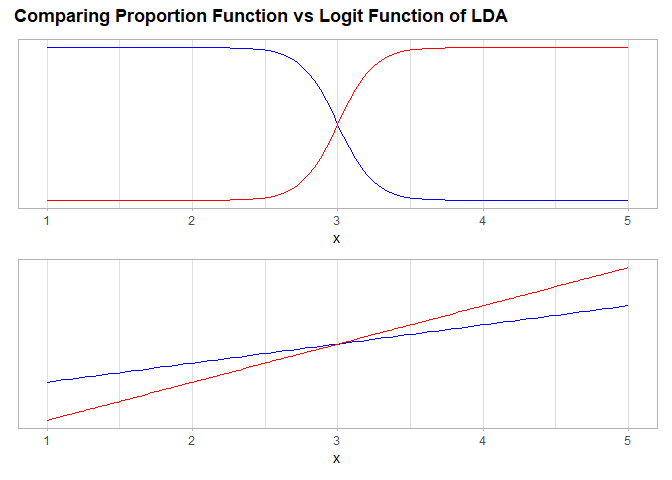

04-execises
================

- <a href="#conceptual" id="toc-conceptual"><span
  class="toc-section-number">1</span> Conceptual</a>
- <a href="#applied" id="toc-applied"><span
  class="toc-section-number">2</span> Applied</a>

## Conceptual

1.  **Using a little bit of algebra, prove that (4.2) is equivalent to
    (4.3). In other words, the logistic function representation and
    logit representation for the logistic regression model are
    equivalent.**

$$
\begin{split}
p(X) &= \frac{e^{\beta_{0}+\beta_{1}X}}
            {1+e^{\beta_{0}+\beta_{1}X}} \\
p(X) (1+e^{\beta_{0}+\beta_{1}X}) & = e^{\beta_{0}+\beta_{1}X} \\
p(X)+p(X) e^{\beta_{0}+\beta_{1}X} & = e^{\beta_{0}+\beta_{1}X} \\
p(X) & = e^{\beta_{0}+\beta_{1}X} - p(X) e^{\beta_{0}+\beta_{1}X} \\
p(X) & = (1 - p(X))e^{\beta_{0}+\beta_{1}X} \\
\frac{p(X)}{1 - p(X)} & = e^{\beta_{0}+\beta_{1}X}
\end{split}
$$

2.  **It was stated in the text that classifying an observation to the
    class for which (4.17) is largest is equivalent to classifying an
    observation to the class for which (4.18) is largest. Prove that
    this is the case. In other words, under the assumption that the
    observations in the kth class are drawn from a N(µk,σ2)
    distribution, the Bayes classifier assigns an observation to the
    class for which the discriminant function is maximized.**

To prove that both functions would provide the same class we need to
check that both functions change from one $Y$ class to other in the same
$x$ value.

If $K = 2$ and $\pi_1 = \pi_2 = \pi_c$ we can show that:

$$
\begin{split}
p_{1}(x) & = p_{2}(x) \\
\frac{\pi_c \frac{1}{\sqrt{2\pi} \sigma} e^{-\frac{1}{2\sigma^2} (x - \mu_{1})^2}}
     {\sum_{l=1}^{K} 
      \pi_l \frac{1}{\sqrt{2\pi} \sigma} e^{-\frac{1}{2\sigma^2} (x - \mu_{l})^2}}
& = 
\frac{\pi_c \frac{1}{\sqrt{2\pi} \sigma} e^{-\frac{1}{2\sigma^2} (x - \mu_{2})^2}}
     {\sum_{l=1}^{K} 
      \pi_l \frac{1}{\sqrt{2\pi} \sigma} e^{-\frac{1}{2\sigma^2} (x - \mu_{l})^2}} \\
e^{-\frac{1}{2\sigma^2} (x - \mu_{1})^2} 
& = 
e^{-\frac{1}{2\sigma^2} (x - \mu_{2})^2} \\
\frac{e^{-\frac{1}{2\sigma^2} (x - \mu_{1})^2}}{e^{-\frac{1}{2\sigma^2} (x - \mu_{2})^2}}
& = 1 \\
(x - \mu_{2})^2 - (x - \mu_{1})^2 
& = 0 \\
x^2 - 2x\mu_{2} + \mu_{2}^2 - (x^2 - 2x\mu_{1} + \mu_{1}^2)
& = 0 \\
2x (\mu_{1}- \mu_{2}) & = \mu_{1}^2 - \mu_{2}^2  \\
x & = \frac{\mu_{1}^2 - \mu_{2}^2}{2 (\mu_{1}- \mu_{2})} \\
x & = \frac{\mu_1 + \mu_2}{2}
\end{split}
$$

And also:

$$
\begin{split}
\delta_{1}(x) & = \delta_{2}(x) \\
\log{(\pi_{c})} 
- \frac{\mu_{1}^2}{2\sigma^2} 
+ x \cdot \frac{\mu_{1}}{\sigma^2} 
& =
\log{(\pi_{c})} 
- \frac{\mu_{2}^2}{2\sigma^2} 
+ x \cdot \frac{\mu_{2}}{\sigma^2} \\
x (\mu_{1} - \mu_{2}) & = \frac{\mu_{1}^2 - \mu_{2}^2}{2} \\
x & = \frac{\mu_{1}^2 - \mu_{2}^2}{2(\mu_{1} - \mu_{2})} \\
x & = \frac{\mu_1 + \mu_2}{2}
\end{split}
$$

Let’s see an example visually by setting as example the next values for
each $Y$ class:

| $k$ | $\sigma$ | $\pi$ | $\mu$ |
|:---:|:--------:|:-----:|:-----:|
|  1  |   0.5    |  0.5  |   2   |
|  2  |   0.5    |  0.5  |   4   |

``` r
library(ggplot2)
library(patchwork)

k_function <- function(x,
                       k,
                       sigma = c(0.5,0.5),
                       pi_k = c(0.5,0.5),
                       mu = c(2, 4),
                       logit = FALSE){
  
  if(logit){
    
    return(x * mu[k]/sigma[k]^2 - mu[k]^2/(2*sigma[k]^2) + log(pi_k[k]))
    
  }
  
  denominator <-
    sapply(x, \(y) sum(pi_k * (1/(sqrt(2*pi)*sigma)) * exp(-1/(2*sigma^2) * (y - mu)^2) ) )
  
  k_numerador <-
   (pi_k[k]* (sqrt(2*pi)*sigma[k])^-1 * exp(- (2*sigma[k]^2)^-1 * (x - mu[k])^2))
  
  return(k_numerador / denominator)
  
}

BasePlot <-
  data.frame(x = 1:5) |>
  ggplot(aes(x))+
  scale_x_continuous(breaks = scales::breaks_width(1))+
  theme_light()+
  theme(panel.grid.major.y = element_blank(),
        panel.grid.minor.y = element_blank(),
        axis.title.y = element_blank(),
        axis.text.y = element_blank(),
        axis.ticks.y = element_blank())
  
p1 <-
  BasePlot +
  geom_function(fun = \(y) k_function(x = y, k = 1), color = "blue")+
  geom_function(fun = \(y) k_function(x = y, k = 2), color = "red")

p2 <-
  BasePlot +
  geom_function(fun = \(y) k_function(x = y, k = 1, logit = TRUE), color = "blue")+
  geom_function(fun = \(y) k_function(x = y, k = 2, logit = TRUE), color = "red")


(p1 / p2) +
  plot_annotation(title = 'Comparing Proportion Function vs Logit Function of LDA',
                  theme = theme(plot.title = element_text(face = "bold")) )
```



3.  **This problem relates to the QDA model, in which the observations
    within each class are drawn from a normal distribution with a class
    specific mean vector and a class specific covariance matrix. We
    consider the simple case where p = 1; i.e. there is only one
    feature. Suppose that we have K classes, and that if an observation
    belongs to the kth class then X comes from a one-dimensional normal
    distribution, X ∼ N(µk, σ2k). Recall that the density function for
    the one-dimensional normal distribution is given in (4.16). Prove
    that in this case, the Bayes classifier is not linear. Argue that it
    is in fact quadratic.**

$$
\begin{split}
p_k(x) & = 
\frac{\pi_k \frac{1}{\sqrt{2\pi} \sigma_k} e^{-\frac{1}{2\sigma_k^2} (x - \mu_{1})^2}}
     {\sum_{l=1}^{K} 
      \pi_l \frac{1}{\sqrt{2\pi} \sigma_l} e^{-\frac{1}{2\sigma_l^2} (x - \mu_{l})^2}} \\
& = 
\frac{\pi_k \frac{1}{\sqrt{2\pi} \sigma_k} e^{-\frac{1}{2\sigma_k^2} (x - \mu_{1})^2}}
     {\frac{1}{\sqrt{2\pi}} 
     \sum_{l=1}^{K}\pi_l \frac{1}{\sigma_l} e^{-\frac{1}{2\sigma_l^2} (x - \mu_{l})^2}} \\
& = 
\frac{\frac{\pi_k}{\sigma_k} e^{-\frac{1}{2\sigma_k^2} (x - \mu_{1})^2}}
     {\sum_{l=1}^{K} \frac{\pi_l}{\sigma_l} e^{-\frac{1}{2\sigma_l^2} (x - \mu_{l})^2}} \\
\end{split}
$$

As the denominator is a constant for any $k$, we can define:
$g(x) = \frac{1}{\sum_{l=1}^{K} \frac{\pi_l}{\sigma_l} e^{-\frac{1}{2\sigma_l^2} (x - \mu_{l})^2}}$

$$
\begin{split}
p_k(x) & = g(x) \frac{\pi_k}{\sigma_k} 
           e^{-\frac{1}{2\sigma_k^2} (x - \mu_{k})^2}\\
\log{(p_k(x))}& =
\log{\left( g(x) \frac{\pi_k}{\sigma_k} 
            e^{-\frac{1}{2\sigma_k^2} (x - \mu_{k})^2} \right)}\\
& =
\log{(g(x))} + \log{(\pi_k)} - \log{(\sigma_k)} -\frac{1}{2\sigma_k^2} (x - \mu_{k})^2 \\
& =
\log{(g(x))} + \log{(\pi_k)} - \log{(\sigma_k)} -\frac{\mu_k^2 - 2\mu_kx + x^2}{2\sigma_k^2} \\
& =
\left( \log{(g(x))} + \log{(\pi_k)} - \log{(\sigma_k)} - \frac{\mu_k^2}{2\sigma_k^2} \right) 
+ \frac{\mu_k}{\sigma_k^2} \cdot x - \frac{1}{2\sigma_k^2} \cdot x^2 \\
\end{split}
$$

4.  **When the number of features p is large, there tends to be a
    deterioration in the performance of KNN and other local approaches
    that perform prediction using only observations that are near the
    test observation for which a prediction must be made. This
    phenomenon is known as the *curse of dimensionality*, and it ties
    into the fact that non-parametric approaches often perform poorly
    when p is large. We will now investigate this curse.**

- **Suppose that we have a set of observations, each with measurements
  on p = 1 feature, X. We assume that X is uniformly (evenly)
  distributed on \[0, 1\]. Associated with each observation is a
  response value. Suppose that we wish to predict a test observation’s
  response using only observations that are within 10 % of the range of
  X closest to that test observation. For instance, in order to predict
  the response for a test observation with X = 0.6, we will use
  observations in the range \[0.55, 0.65\]. On average, what fraction of
  the available observations will we use to make the prediction?**

## Applied
